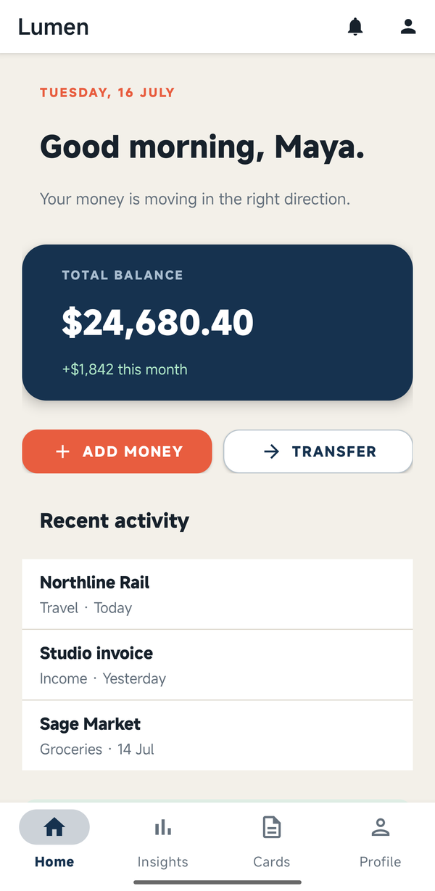
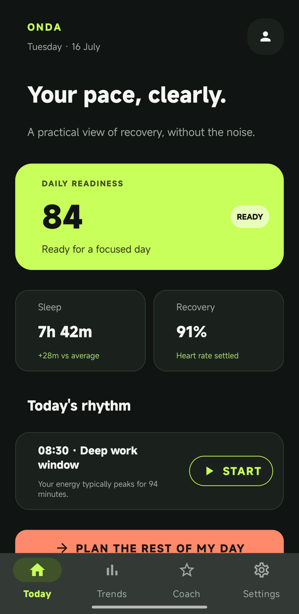
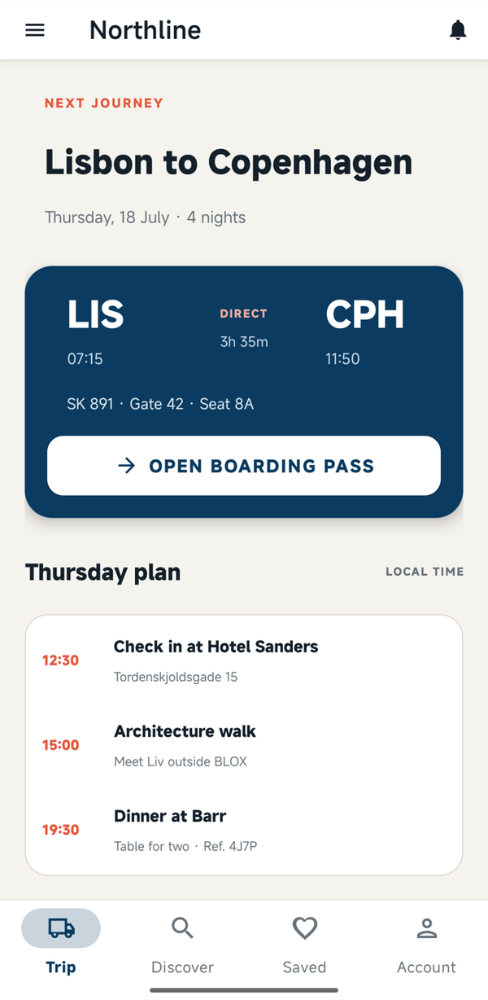
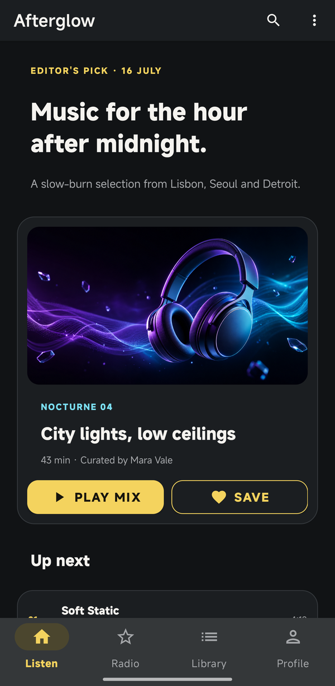

# 🚀 ApkPy — Build Native Android Apps in Pure Python

> **Transform Python scripts into real, native Android projects — no Java required.**

[](https://pypi.org/project/apkpy/)
[](https://python.org)
[](#-license)
[](https://developer.android.com)

**Documentation:** [Start here](docs/index.md) · [Installation](docs/getting-started.md) · [Audio, playlists and Spotify](docs/media-auth.md) · [Security](docs/data-security.md) · [Public API](docs/api-reference.md)

**ApkPy** is a closed-source Python-to-Android transpiler. Write your app in pure Python using a clean, CSS-inspired design system. ApkPy parses your Python code, generates native Java + XML Android projects, and either bundles them into a ready-to-compile `.zip` or — with a single `apkpy run` — compiles them straight into an installable `.apk`. **No Java, no Kotlin, no Android Studio.**

---

## ApkPy 1.2.2 - Keyed feed mutations

ApkPy 1.2.2 extends `virtual_collection()` with efficient operations for
records that are already on screen:

```python
feed.prepend_items([new_post])
feed.update_item(
    "post-42",
    {"liked": True, "likes": 129},
    optimistic="like-post-42",
)
feed.remove_item("post-19", optimistic="delete-post-19")
feed.merge_items(websocket_items, key="id")

if request_succeeded:
    feed.commit("like-post-42")
else:
    feed.rollback("like-post-42")
```

Existing order and scroll position are preserved. Android emits targeted
adapter notifications for prepend, update and remove, while merges and
rollbacks use `DiffUtil`. The Previewer follows the same stable-key and
optimistic-transaction contract.

[Build a production feed](docs/production-feeds.md) ·
[Compatibility and limits](docs/compatibility.md) ·
[Read the complete 1.2.2 guide](RELEASE_1.2.2.md)

---

## ApkPy 1.2.1 — Production Feeds

Version 1.2.1 adds application-controlled pagination to
`virtual_collection()`. Timelines, chats, music libraries, product catalogues
and delivery lists can now append pages efficiently, request the next page
before the reader reaches the final row and refresh from the top.

```python
feed = virtual_collection(
    [],
    template={
        "image": "{avatar}",
        "title": "{author}",
        "subtitle": "{message}",
        "meta": "{time}",
    },
    on_end_reached=load_more,
    on_refresh=reload_feed,
    prefetch=4,
    screen=home,
)

def page_loaded(success, body):
    if success:
        feed.append_items(json_get(body, "items"), has_more=True)
    else:
        feed.finish_load()  # releases the latch so the request can be retried
```

The loading latch rejects duplicate end callbacks. `has_more=False` stops
further page requests until a refresh. `feed.refresh()` starts the same flow as
the pull gesture, while `set_items(..., has_more=...)` replaces the records and
completes an active refresh automatically.

On Android this is a native `RecyclerView.OnScrollListener`,
`notifyItemRangeInserted()` and, only when refresh is requested,
`SwipeRefreshLayout 1.2.0`. Plain virtual collections receive no new helper
code or refresh dependency.

[Read the complete 1.2.1 guide](RELEASE_1.2.1.md) ·
[Open the site release page](docs/version-1.2.1.md)

---

## ✨ What's new in ApkPy 1.1.0

Version 1.1.0 turns ApkPy's styling layer into a complete native design system.
The work was delivered as nine connected parts rather than isolated widgets:

1. **Global Theme and design tokens** shared by the Previewer, generated
   resources, Material components and Android system bars.
2. **Material buttons and native vector icons** with filled, outlined, tonal,
   text, danger and accessible icon-only variants.
3. **Responsive composition** for mobile, tablet and landscape from one Python
   component tree.
4. **Flex, grid and layered layouts** with wrapping, grow/shrink, spans, aspect
   ratios, absolute positioning and z-index.
5. **Material cards** in ready-made media and freely composable forms.
6. **Fixed and collapsible app bars** backed by native Material toolbars.
7. **Overlays** including bottom sheets, dialogs, menus, snackbars, tooltips and
   date/time pickers.
8. **Loading, skeleton, empty and error states** that switch without rebuilding
   the page.
9. **Smart images and avatars** with placeholders, fallbacks, caching, fade,
   blur, tint, aspect ratios and presence badges.

The APIs are designed to work together. A themed screen can use a native app
bar, responsive card layout, overlay actions and smart artwork without giving
up CSS-level control:

```python
from apkpy_lib import (
    Screen, Theme, action, app_bar, button, card, card_action,
    image, run, snackbar,
)

home = Screen(id="home", scroll=True)
app_bar(
    "Library",
    actions=[action("search", label="Search")],
    screen=home,
)

image(
    "https://example.com/cover.jpg",
    placeholder="cover-placeholder.png",
    fallback="cover-fallback.png",
    cache=True,
    fade_in=True,
    aspect_ratio="16:9",
    screen=home,
)

card(
    title="Nocturne 04",
    subtitle="43 min · Curated by Mara Vale",
    actions=[
        card_action(
            "Play mix",
            variant="filled",
            icon="play_arrow",
            command=lambda: snackbar("Playing Nocturne 04"),
        )
    ],
    screen=home,
)

theme = Theme(
    mode="dark",
    primary="#8B5CF6",
    secondary="#22D3EE",
    background="#09090B",
    surface="#18181B",
    text="#FAFAFA",
)

run(start_screen=home, theme=theme)
```

The release also improves Previewer/Android parity for button geometry, vector
icons, rounded surfaces, bottom sheets, compact Material toasts, image crop and
tint, responsive button wrapping and Material theme compatibility.

The existing native stack remains available alongside the new visual system:
SQLite and parameterized SQL, the complete REST client, automatic encrypted
storage, AES-256-GCM, PBKDF2 password hashing, background audio, queues,
favourites, downloads and editable playlists are all documented below.

| Lumen · finance | Onda · wellbeing |
| :---: | :---: |
|  |  |
| Northline · travel | Afterglow · music |
|  |  |

[Read the complete 1.1.0 guide with code for all nine parts](RELEASE_1.1.0.md)

---

## ApkPy 1.2.0 makes the native audio foundation explicit

The 1.2.0 release documents the native music capabilities that were already
implemented but easy to miss when reading individual API entries:

- local-file and URL playback, seeking and a metadata-aware playback queue;
- a generated Android foreground media service that survives Activity changes,
  backgrounding and a locked screen;
- a native `MediaSession` plus notification and lock-screen metadata and
  previous, play/pause and next controls;
- native audio-focus pause, duck and resume behaviour;
- next/previous, shuffle, repeat, synchronized player bindings and a persistent
  mini-player;
- favourites, persistent user playlists, playlist editing and explicit offline
  downloads to app-private storage;
- buffering state, safe duration/position polling and one retry of the same
  source after a prepare failure, without advancing through the queue on error.

```python
audio.play_background(
    "https://cdn.example.com/night-drive.mp3",
    title="Night Drive",
    artist="Nova",
    art="https://cdn.example.com/night-drive.jpg",
)

audio.play_playlist(
    sources,
    titles=titles,
    artists=artists,
    arts=artwork,
    start=0,
)

audio.now_playing(progress=seek, time=elapsed, cover=cover,
                  title=title, artist=artist)
audio.controls(play_pause=play_pause, shuffle=shuffle, repeat=repeat)
mini_player(open=player)
```

This is a capability statement, not inflated marketing. Transparent audio
caching, adaptive quality selection, guaranteed gapless playback, crossfade,
DRM and resumable downloads with progress are **not supported yet**. ApkPy
streams the source supplied by the app without transcoding it; the server and
source determine its bitrate and quality.

[Read the complete 1.2.0 release guide](RELEASE_1.2.0.md)

### Eight native runtime areas in ApkPy 1.2.0

| Area | Public surface | Android foundation |
| --- | --- | --- |
| Large feeds | `virtual_collection()` | recycled `RecyclerView` rows or grid cells |
| Reactive UI | `state()` and `lifecycle()` | observable fields and Activity lifecycle |
| Transfers | `uploads` | streaming multipart worker with progress/cancel |
| Live data | `websocket` | OkHttp WSS, ping/pong, queue and reconnect |
| Video | `video()` | Media3/ExoPlayer |
| Push | `push` | conditional Firebase Messaging output |
| Location | `map_view()`, `routes`, `location` | OpenStreetMap, Fused Location and foreground service |
| Documents | `rich_text()`, `markdown()`, `tree_view()` | native spans and a visible-row `RecyclerView` |

```python
from apkpy_lib import Screen, markdown, rich_text, tree_view

knowledge = Screen(id="knowledge", scroll=True)

rich_text(
    [
        {"text": "FIELD NOTE\n", "bold": True,
         "color": "#22D3EE", "size": 12},
        {"text": "Small interfaces, ", "bold": True, "size": 23},
        {"text": "deep structure.", "bold": True, "italic": True,
         "color": "#C4B5FD", "size": 23},
    ],
    screen=knowledge,
)

markdown(
    """## Build log

> Selectable, structured and native.

- [x] **Bold**, *italic*, ~~strike~~ and `inline code`
- [x] Lists, links, quotes and dividers
""",
    screen=knowledge,
)

tree_view(
    [{
        "key": "workspace",
        "title": "Workspace",
        "children": [
            {"title": "Roadmap", "subtitle": "Q3 planning"},
            {"title": "Release notes", "subtitle": "12 entries"},
        ],
    }],
    expand_depth=1,
    row_height=60,
    screen=knowledge,
)
```

Android uses `SpannableStringBuilder` and a recycled `RecyclerView`; no WebView
or JavaScript runtime is added. The application keeps ownership of storage,
sync, authentication and moderation.

[Read the native rich-content guide](docs/rich-content.md) ·
[See the complete 1.2.0 runtime page](docs/version-1.2.0.md)

---

## ✨ What's in v1.0.0

> One-command APK builds, automatic encrypted storage, AES-256-GCM + PBKDF2 security, real Python logic, native media playback, rich lists, bottom navigation, and scrollable screens.

### 🚀 `apkpy run` — Python → installable APK in one command

Go from a `.py` file to an app on your phone **without ever opening Android Studio**:

```bash
apkpy run
```

ApkPy transpiles your code, compiles it with Gradle, and drops a ready-to-install **`.apk` right next to your script**. Getting it onto a phone is optional and your choice:

- **`apkpy run --qr`** — serves the APK over your Wi-Fi and prints a scannable QR code. Scan it, tap install, done. (The `.apk` is on disk either way — if you'd rather not scan anything, just copy the file across.)
- **`apkpy run --usb`** — installs straight to a USB-connected device via `adb`.

Two helpers round it out:

- **`apkpy doctor`** — checks whether your machine has what it needs (a JDK 17–21, the Android SDK, and Gradle) and tells you exactly what's missing.
- **`apkpy setup`** — downloads a compatible toolchain into `~/.apkpy` for machines that don't already have Android Studio.

> **Requirements:** a JDK (17–21) and the Android SDK. Already have Android Studio? ApkPy finds and reuses its bundled JDK and SDK automatically — zero configuration. Otherwise run `apkpy setup` once. Prefer to compile in Android Studio yourself? `apkpy build` still produces a `.zip` project.

### 🗂️ `bottom_nav` — Native Bottom Navigation Bar

Add a tab bar at the bottom of every screen — the standard Android pattern for apps with 2–5 top-level sections (think Instagram, WhatsApp, YouTube).

```python
from apkpy_lib import Screen, label, button, inputs, list_view, toast, bottom_nav, run

# ── Screens ───────────────────────────────────────────
home     = Screen(id="home")
explore  = Screen(id="explore", scroll=True)
profile  = Screen(id="profile")

# ── Home ──────────────────────────────────────────────
label("Dashboard", id="dash_title", screen=home)
button("Get started", id="btn_start", command=lambda: toast("Let's go!"), screen=home)

# ── Explore (scrollable with a list) ──────────────────
label("Trending", id="exp_title", screen=explore)
explore_list = list_view(
    [
        {"title": "Morning Routine",   "subtitle": "10 min · Productivity"},
        {"title": "Deep Focus",        "subtitle": "25 min · Work"},
        {"title": "Evening Wind-Down", "subtitle": "15 min · Wellness"},
    ],
    id="exp_list",
    screen=explore,
    on_click=lambda item: toast(item["title"])
)

# ── Profile ───────────────────────────────────────────
label("Alex Johnson",     id="p_name",    screen=profile)
label("alex@example.com", id="p_email",   screen=profile)
button("Log out", id="btn_logout", command=lambda: toast("Bye!"), screen=profile)

# ── Bottom nav — call once, outside any screen ────────
bottom_nav(
    [home, explore, profile],
    labels=["Home", "Explore", "Profile"],
    icons=["home", "search", "person"]
)

style = """
home    { background-color: #0F172A; padding: 24px; gap: 16px; }
explore { background-color: #0F172A; padding: 24px; gap: 14px; }
profile { background-color: #0F172A; padding: 32px; gap: 12px; }
dash_title { color: #F8FAFC; font-size: 26px; font-weight: bold; }
btn_start  { background-color: #6366F1; color: #FFFFFF; border-radius: 12px; padding: 14px; }
exp_title  { color: #F8FAFC; font-size: 22px; font-weight: bold; }
exp_list   { background-color: #1E293B; color: #F8FAFC; border-color: #334155; height: 400px; }
p_name     { color: #F8FAFC; font-size: 22px; font-weight: bold; }
p_email    { color: #94A3B8; font-size: 14px; }
btn_logout { background-color: #1E293B; color: #F87171; border-radius: 12px; padding: 14px; }
"""

if __name__ == "__main__":
    run(start_screen=home)
```

**Available icons:** `home` · `person` · `settings` · `search` · `list` · `add` · `star` · `bell` · `chart` · `message` · `heart` · `camera` · `info` · `circle`

**On Android:**
- Compiles to `BottomNavigationView` with a `RelativeLayout` wrapper — content always sits above the bar, nothing gets hidden behind it
- Menu XML and vector drawables are auto-generated — no image assets or icon fonts needed
- Tab switches use `FLAG_ACTIVITY_REORDER_TO_FRONT` — Activities are reused, not recreated; switching is instant
- Each Activity has an `onResume()` that restores the correct selected tab — pressing the system back button and returning to a screen always shows the right tab highlighted
- Active icon/label: white. Inactive: grey. Bar background: `#1E293B`

**Hot Previewer:** Dark 56 px bar at the bottom, one column per tab, active-tab indicator line + bold white label.

> Call `bottom_nav` once at the top level — outside any screen or function. It applies to all listed screens automatically.

---

### 📦 Passing Data Between Screens

Pass values when navigating with `on_click_navigate(screen, data={...})` and read them on the destination screen with `screen.get_param("key")`.

```python
from apkpy_lib import Screen, label, list_view, on_click_navigate, run

list_screen   = Screen(id="list_screen")
detail_screen = Screen(id="detail_screen")

items = [{"title": "Apple", "subtitle": "A red fruit"}, {"title": "Banana", "subtitle": "A yellow fruit"}]

# Tap list item → navigate with data
item_list = list_view(
    items,
    screen=list_screen,
    on_click=lambda item: on_click_navigate(detail_screen, data={"title": item["title"], "desc": item["subtitle"]})
)

# Read data on the destination screen
lbl_name = label("", screen=detail_screen)
lbl_desc = label("", screen=detail_screen)

lbl_name.set_value(detail_screen.get_param("title"))         # required param
lbl_desc.set_value(detail_screen.get_param("desc", "N/A"))   # optional default
```

Works the same way with `button` clicks:

```python
btn = button("Go", screen=list_screen,
             command=lambda: on_click_navigate(detail_screen, data={"id": "42"}))
```

**On Android** — `on_click_navigate(..., data={"k": v})` compiles to `intent.putExtra("k", String.valueOf(v))`. `screen.get_param("k")` compiles to `getIntent().getStringExtra("k")`.

**In the Hot Previewer** — params are stored in `screen._params` before navigation; `get_param` reads from that dict.

---

### 📜 Scrollable Screens

Pass `scroll=True` to any `Screen` to make the whole page vertically scrollable. All components — labels, inputs, buttons, and lists — scroll together as one page.

```python
home = Screen(id="home", scroll=True)
```

In the Hot Previewer, scroll with the mouse wheel from anywhere on the screen. On Android, compiles to a `NestedScrollView` wrapping a `LinearLayout` — no manual XML editing needed.

### 📋 `list_view` — Native Scrollable List

Render a vertical list of items with an optional click handler. Accepts plain strings or dicts with `"title"` and `"subtitle"` keys.

```python
from apkpy_lib import Screen, list_view, toast, run

home = Screen(id="home", scroll=True)

items = [
    {"title": "08/06/2026", "subtitle": "Mood: Great — Energy: 85"},
    {"title": "07/06/2026", "subtitle": "Mood: Good — Energy: 70"},
]

history = list_view(
    items,
    id="history_list",
    screen=home,
    on_click=lambda item: toast(item["title"] + ": " + item["subtitle"]),
)
```

Update the list at runtime:

```python
def save():
    items.insert(0, {"title": "today", "subtitle": "Mood: Great"})
    history.set_items(items)
```

Style it with CSS:

```css
history_list {
    background-color: #1E293B;
    color: #F8FAFC;
    border-color: #334155;
}
```

> In scroll screens, `list_view` compiles to `TextViews` inside a `LinearLayout` — no nested scroll conflict.

### 📊 Data → UI — feed a `list_view` straight from SQLite or an API

`set_items` now accepts a **JSON string** — exactly what `db.query()` returns and what REST APIs respond with. `title=`/`subtitle=` pick which field of each object to display:

```python
notes_list = list_view([], id="notes_list", screen=notes)

def refresh():
    rows = db.query("SELECT content, created FROM notes ORDER BY id DESC")
    notes_list.set_items(rows, title="content", subtitle="created")

refresh()   # module-level call runs on app start — the list is filled on launch
```

The same one-liner works with an `https` response (Supabase, Firebase, any REST API):

```python
def on_response(success, response):
    if success:
        users_list.set_items(response, title="name", subtitle="email")
```

- Each row renders as `title — subtitle`; arrays of plain values also work; invalid JSON gives an empty list instead of a crash.
- Module-level calls to your own functions (like `refresh()`) now compile into Android's `onCreate` — initial data loads automatically.
- This closes the **fetch → list → tap → detail** loop: `db`/`https` fetch, `set_items` shows, `on_click` + `on_click_navigate(data=...)` navigate.
- Try it: `apkpy examples` → **[11] DB Notes List**, or `examples/14_db_notes_list.py`.

---

### 🎵 Build music apps — audio, queues, mini-player, favourites & playlists

v1.0.0 can build a complete Spotify-style music experience in pure Python. Audio runs through the native Android media stack: foreground playback keeps playing when the app is backgrounded, integrates with the notification/lock screen, handles audio focus, and exposes queue controls to the UI. The Hot Previewer implements the same public API so the app flow can be tested on desktop.

```python
from apkpy_lib import Screen, button, label, image, inputs, audio, mini_player, run

home = Screen(id="home")
player = Screen(id="player")
cover = image("https://example.com/cover.jpg", screen=player)
title = label("Nothing playing", screen=player)
artist = label("", screen=player)
seek = inputs("", type="range", screen=player)
time = label("0:00 / 0:00", screen=player)
play_pause = button("▶", screen=player)
shuffle = button("Shuffle", screen=player)
repeat = button("Repeat", screen=player)

audio.now_playing(progress=seek, time=time, cover=cover, title=title, artist=artist)
audio.controls(play_pause=play_pause, shuffle=shuffle, repeat=repeat)
mini_player(open=player)

def start_album():
    audio.play_playlist(
        ["https://example.com/one.mp3", "https://example.com/two.mp3"],
        titles=["First Track", "Second Track"],
        artists=["The Example Band", "The Example Band"],
        arts=["https://example.com/one.jpg", "https://example.com/two.jpg"],
    )

button("Play album", command=start_album, screen=home)
run(start_screen=home)
```

The playback API includes:

- `audio.play(src)`, `pause()`, `resume()`, `stop()` and `seek(seconds)` for basic playback.
- `audio.play_background(src, title=..., artist=..., art=...)` for a background track with native media notification and lock-screen metadata.
- `audio.play_playlist(sources, titles=..., artists=..., arts=..., start=...)`, plus `next()` and `previous()`, for a real queue. `start` may be an index or the selected source URL.
- `audio.shuffle()` and `audio.repeat()` for queue modes.
- `audio.now_playing(...)` to bind progress, elapsed/total time, cover, title and artist components to the current track. Moving the bound range input seeks through the track.
- `audio.controls(...)` to turn ordinary ApkPy buttons into synchronized play/pause, shuffle and repeat controls.
- `mini_player(open=player)` to place a persistent now-playing bar above the bottom navigation; tapping it opens the full player.

Playback uses an Android foreground `Service` and `MediaSession`, publishes transport controls and album art to the system notification/lock screen, reacts to audio-focus loss (pause/duck/resume), and keeps the queue alive while Activities move between foreground and background.

#### Favourites and user playlists

Favourites and playlists are persistent and need no database schema:

```python
liked_button = button("🤍", screen=player)
liked_tracks = list_view([], rich=True, screen=home)
playlists = list_view([], screen=home)
editor = list_view([], rich=True, screen=home)

audio.like_button(liked_button, liked="❤️", unliked="🤍")
audio.liked_list(liked_tracks)
audio.playlists_list(playlists)
audio.add_to_playlist("Road trip")
audio.play_saved_playlist("Road trip")
audio.edit_playlist("Road trip")
audio.playlist_editor(editor)
audio.remove_from_playlist("Road trip")
audio.delete_playlist("Road trip")
```

`like_button` follows the current track automatically. `liked_list`, `playlists_list`, and `playlist_editor` repopulate their bound lists when the relevant screen resumes. Playlist entries preserve the source, title, artist and cover needed to play them again.

---

### 🖼️ Rich lists, horizontal carousels and grids

Media-heavy apps can render native cards with a title, subtitle, remote image and optional `src` payload:

```python
tracks = [{
    "title": "Midnight Drive", "subtitle": "Neon Avenue",
    "image": "https://example.com/midnight.jpg",
    "src": "https://example.com/midnight.mp3",
}]

def play_track(item):
    audio.play_background(item["src"], title=item["title"],
                          artist=item["subtitle"], art=item["image"])

results = list_view(tracks, screen=home, rich=True, on_click=play_track)
recent = carousel(tracks, screen=home, on_click=play_track)
genres = grid(tracks, screen=home, cols=2, on_click=play_track)
```

- `list_view(..., rich=True)` generates native rows with thumbnail, title and subtitle. Dynamic JSON can include artwork with `set_items(rows, title="name", subtitle="artist", image="cover")`.
- `carousel(...)` generates a horizontally scrolling shelf of cards.
- `grid(..., cols=N)` generates an Android `GridLayout` with the requested number of columns.
- Remote covers load asynchronously and automatically add the `INTERNET` permission.
- The complete item remains available to `on_click`, including custom fields such as `src`.

---

### 📥 Offline audio downloads

The `files` API downloads media or any other file into app-private storage:

```python
def downloaded(success, path):
    if success:
        audio.play(path)
    else:
        toast("Download failed")

files.download("https://example.com/song.mp3", "song.mp3", on_result=downloaded)
if files.exists("song.mp3"):
    audio.play(files.path("song.mp3"))
files.delete("song.mp3")
```

Downloads run off the UI thread. On Android the files live in the app's private directory, so no broad storage permission is required.

---

### 🔐 OAuth login and user profiles — Google, Spotify & GitHub

ApkPy includes OAuth 2.0 Authorization Code flow with PKCE. It ships provider defaults for Google, Spotify and GitHub, supports custom endpoints, stores the access token, and fetches a normalized profile.

```python
login = Screen(id="login")
home = Screen(id="home")
name = label("", screen=home)

def load_profile(user):
    name.set_value(user["name"])

def sign_in():
    auth.login(provider="spotify", client_id="YOUR_SPOTIFY_CLIENT_ID",
               scopes=["user-read-email", "user-read-private"], then=home)

def sign_out():
    auth.logout()

button("Continue with Spotify", command=sign_in, screen=login)
button("Load profile", command=lambda: auth.user(on_result=load_profile), screen=home)
button("Log out", command=sign_out, screen=home)
run(start_screen=login)
```

Useful calls are `auth.login(...)`, `auth.is_logged_in()`, `auth.token()`, `auth.user(on_result=...)`, and `auth.logout()`. `auth.user` normalizes provider data to `{"name", "email", "picture"}`.

On Android the browser returns through the `apkpy://auth` deep link and a generated Activity exchanges the code for a token. The Previewer uses a loopback redirect such as `http://127.0.0.1:8888/callback`. Register both redirect URIs with the provider. PKCE means a client secret is not embedded in the APK.

> These primitives are enough to build a Spotify-style client or authenticate with Spotify, but ApkPy does not bundle Spotify's catalogue. Tracks, artwork and API access must come from sources you are authorized to use, subject to the provider's terms.

---

### 🔁 `for` Loops — real Python iteration, compiled to native Java

Plain Python `for` loops now work on Android. Iterate lists, `range()`, **and rows straight from `db.query()` or an API response** — `row["column"]` reads each field:

```python
# Over a list
for fruta in ["Maçã", "Pera", "Uva"]:
    db.execute("INSERT INTO itens (nome) VALUES (?)", [fruta])

# Counting
for i in range(5):
    status.set_value(f"step {i}")

# Over database rows  ⭐
rows = db.query("SELECT nome, idade FROM pessoas")
for row in rows:
    toast(f"{row['nome']} tem {row['idade']} anos")

# Over an API response, inside the callback
def on_posts(ok, resp):
    if ok:
        for post in resp:
            db.execute("INSERT INTO cache (title) VALUES (?)", [post["title"]])
```

- Works inside callbacks, at module level (runs on app start), nested, and with `if`/`else` in the body.
- **`break` and `continue` are supported** — they compile to native Java `break;`/`continue;` (e.g. `for i in range(100): if i == 5: break`).
- On Android, list loops compile to `for (String x : ...)`, JSON loops to an `org.json.JSONArray` walk with safe field access — invalid/non-array JSON means the loop runs zero times instead of crashing.
- In the Hot Previewer it's real Python: `db.query()` results and `https` responses are iterable row-by-row while still being normal JSON strings.

---

### 🌐 Full REST Client — PUT, PATCH & DELETE

`https` now speaks all five HTTP methods — **full CRUD against any REST backend** (Supabase, Firebase, Django, FastAPI...). `put`/`patch` work like `post`; `delete` works like `get`:

```python
from apkpy_lib import https

https.get("https://api.example.com/users/42", on_response=on_done)
https.post("https://api.example.com/users", '{"name": "Alex"}',
           headers={"Content-Type": "application/json"}, on_response=on_done)
https.put("https://api.example.com/users/42", '{"name": "Alex", "age": 30}',
          headers={"Content-Type": "application/json"}, on_response=on_done)
https.patch("https://api.example.com/users/42", '{"age": 31}',
            headers={"Content-Type": "application/json"}, on_response=on_done)
https.delete("https://api.example.com/users/42", on_response=on_done)
```

- Every callback receives `(success, response)`; on a 4xx/5xx error, `response` is the **error body** the server returned — show the user what went wrong.
- Always non-blocking (background thread), callback delivered on the UI thread, `INTERNET` permission declared automatically.
- PATCH on Android falls back to `POST` + `X-HTTP-Method-Override: PATCH` (the standard workaround for `HttpURLConnection`); the Previewer sends native PATCH.
- Try it: `apkpy examples` → **[10] REST Client**, or `examples/13_rest_client.py`.

---

### 🔐 Security — crypto, encrypted storage & safe SQL

Anyone can decompile an APK and read SharedPreferences or the SQLite file. v1.0.0 ships a complete security layer — zero external dependencies, no new permissions, and the same Python code in the Hot Previewer and on Android.

**Password hashing (PBKDF2 + salt) — no `hashlib` import needed:**

```python
from apkpy_lib import storage, crypto

def register():
    storage.set("pw_hash", crypto.hash_password(pw_in.get_value()))

def do_login():
    ok = crypto.verify_password(pw_in.get_value(), storage.get("pw_hash", ""))
    if ok:
        toast("Welcome back!")
```

- Stored as `pbkdf2-sha256$200000$<salt>$<hash>` — 200,000 iterations make GPU brute-force ~200,000× slower, and the random salt means the same password never produces the same hash twice.
- `verify_password` uses a constant-time comparison and returns a real boolean.
- Hashes are bit-for-bit identical in the Previewer (Python `hashlib.pbkdf2_hmac`) and on Android (native `javax.crypto.Mac` loop) — fully portable.

**Two-way encryption for data you need to read back:**

```python
db.execute("INSERT INTO secrets (content) VALUES (?)", [crypto.encrypt(secret)])
plain = crypto.decrypt(stored_value)
```

On Android this is **AES-256-GCM with the key stored in the Android Keystore** — hardware-backed and non-extractable, even with root. Encrypted values are per-device by design: a stolen database cannot be decrypted anywhere else.

**Automatic storage encryption:** every value passed to `storage.set()` is encrypted before it touches the disk and decrypted transparently by `storage.get()` — the SharedPreferences XML only ever contains `enc1$…` ciphertext. Zero code changes needed.

**Parameterized SQL — injection-proof queries:**

```python
db.execute("INSERT INTO users (name) VALUES (?)", [name])        # safe
rows = db.query("SELECT * FROM users WHERE name = ?", [name])    # safe
```

The `?` placeholders are filled by the SQLite engine itself, never concatenated into the SQL — `O'Brien` no longer breaks the query, and `x'); DROP TABLE users; --` is stored as harmless text instead of being executed.

---

### 🧠 Real Python logic — your own functions, comparisons & live queries

Three language features that used to run **only** in the Previewer now compile to native Java as well — so what you test is what ships.

**Functions with arguments** — define your own helpers that take parameters and call them from any button or list item:

```python
def adjust(delta):
    db.execute("UPDATE tank SET level = MAX(0, MIN(100, level + ?))", [delta])
    refresh()

button("＋ Fill",  id="fill",  command=lambda: adjust("10"),  screen=home)
button("－ Drain", id="drain", command=lambda: adjust("-10"), screen=home)
```

Compiles to a real `pythonCallback_adjust(String delta)` method with a typed call site — previously these calls were silently dropped on Android.

**Comparison operators in `if`** — `<`, `>`, `<=`, `>=` now join `==` and `!=`. Numbers compare numerically (floats included), strings lexicographically, exactly like Python:

```python
if level >= 80:
    status.set_value("Almost full 🌊")
if level <= 20:
    status.set_value("Almost empty 🪣")
```

**Iterate `db.query()` directly** — loop over query results inline, no temporary variable needed:

```python
for row in db.query("SELECT level FROM tank"):
    gauge.set_value(f"{row['level']}%")
```

The inline form used to compile to an empty result set on Android (it worked only in the Previewer); now both the inline and the assigned (`rows = db.query(...)`) forms generate the same native SQLite read.

---

### 🎲 `random` — bundled in apkpy_lib

No stdlib import needed — `random` ships **with apkpy_lib**. Just `from apkpy_lib import random` and use it like normal Python; it compiles to native Android (`java.util.Random` / `Math.random()`). Great for dice, pickers, quizzes and games:

```python
from apkpy_lib import random

def roll_dice():
    return random.randint(1, 6)              # integer in [1, 6]

prize  = random.choice(["Gold", "Silver", "Bronze"])  # random list element
chance = random.random()                     # float in [0.0, 1.0)
```

Random **values won't match** between the Previewer (Python's `random`) and Android (`java.util.Random`) — and that's correct: unlike arithmetic, the guarantee is "valid random in range on both sides", not "the same number".

---

### 📱 `device(...)` — preview on any screen size

A **Previewer-only** helper to see your app at different phone sizes (or full screen) while you build. It's **ignored on Android** — there the real screen *is* the device — so it's stripped from the build and never changes the generated APK:

```python
from apkpy_lib import device

device("Pixel 8")         # resize the preview window to that model
device("fullscreen")      # borderless full screen (press Esc to exit)
device("maximized")       # maximised window, keeps the title bar (X to close)
```

Every Pixel from the **Pixel 4 to the Pixel 10 Pro** is accepted (models that share a screen size map to the same dimensions); the default stays Pixel 9. In `fullscreen` / `maximized` the content sits in a centred phone-width column.

---

### 🧬 f-strings — `f"...{value}..."`

Drop variables and inline expressions straight into text — no more `+` / `str()` gluing:

```python
nome = "Ana"
preco = 12.5
recibo.set_value(f"Olá {nome}! Total: {preco:.2f} €")   # "Olá Ana! Total: 12.50 €"
```

`{a + b}` runs the arithmetic inline; `{preco:.2f}` fixes the decimals (compiles to `String.format(Locale.US, "%.2f", ...)`, matching Python exactly).

---

### 🔁 `while`, `+=` and `.isdigit()` — more real Python

```python
# while — same conditions as `if`, with break / continue
i = 0
total = ""
while i < 5:
    total += str(i)        # += / -= / *= augmented assignment
    i += 1

# .isdigit() — validate before int()/float() so bad input never crashes
valor = campo.get_value()
if valor.isdigit():
    n = int(valor)
    resultado.set_value(f"O dobro é {n * 2}")
else:
    resultado.set_value("Escreve um número válido!")
```

`while` gets an automatic safety limit on Android, so an accidental infinite loop can't freeze the UI thread. `.isdigit()` compiles to `matches("\\d+")` — the right guard, since `int("")` / `int("abc")` would otherwise force-close the app on Android.

Two more string checks — **`.startswith(x)`** and **`.endswith(x)`** — validate prefixes and suffixes (emails, links, codes, file names) and map **directly** to Java's `.startsWith(...)` / `.endsWith(...)`:

```python
url = url_in.get_value()
if not url.startswith("https://"):
    aviso.set_value("⚠️ Não é seguro")
elif url.endswith(".pt"):
    aviso.set_value("✅ Site português 🇵🇹")
```

---

### 🕐 `datetime` — date & time bundled in apkpy_lib

Like `random`, no stdlib import — everything returns a string and compiles to native `SimpleDateFormat`:

```python
from apkpy_lib import datetime

datetime.now()    # "2026-06-16 14:30:45"
datetime.date()   # "2026-06-16"
datetime.time()   # "14:30:45"
datetime.hour()   # "14"   (also year/month/day/minute/second)

def atualizar():
    hora = int(datetime.hour())
    if hora < 12:
        saudacao.set_value("Bom dia ☀️")
    elif hora < 20:
        saudacao.set_value("Boa tarde 🌤️")
    else:
        saudacao.set_value("Boa noite 🌙")
```

The format is identical on both sides; the exact second won't match (two clocks read a moment apart), just like `random`.

---

### 📦 `from apkpy_lib import *`

```python
from apkpy_lib import *
```

Brings every public name — `Screen`, `label`, `button`, `inputs`, `container`, `list_view`, `run`, `storage`, `crypto`, `db`, `https`, `random`, `datetime`, and the rest. (`container` — for grouping/nesting components, and laying them in a row with `display: flex; flex-direction: row` — is now exported too.)

---

### 📦 `apkpy.toml` — your app's name, icon, package id & version

```toml
[app]
name = "Link Checker"                         # shown under the icon
application_id = "com.mycompany.linkchecker"   # unique Play Store id
version_name = "1.0"
version_code = 1
icon = "icon.png"                              # optional square PNG (needs Pillow)
```

`apkpy init` scaffolds it; `apkpy run` / `apkpy build` apply it automatically — the `name` becomes the launcher label (it used to be hardcoded "ApkPy App"), the `icon` is generated in every density, and `application_id` / `version_*` flow into the build. No `apkpy.toml`? `apkpy run` asks for the name the first time and saves it.

---

### 🔑 `apkpy release` — signed builds for the Play Store

```bash
apkpy release          # signed .apk (installs on any phone — unsigned ones don't)
apkpy release --aab    # .aab App Bundle for Google Play
```

ApkPy creates a signing key the first time and **reuses it for every update** (the Play Store requires the same key). Back up the keystore (`~/.apkpy/keystores/…`) — lose it and you can't ship updates.

> A sideloaded signed `.apk` still shows a Play Protect "unknown developer" warning — that's normal for any app installed outside the store. It goes away once the app is published on Google Play and installed from there.

---

### 🐛 Bug Fixes

- Fixed string literals containing a newline (`"a\nb"`), tab or backslash breaking the Android build with `error: unclosed string literal`. Only quotes were being escaped, so a `\n` ended a Java string mid-line. The fix escapes `\`, `\n`, `\r`, `\t` and quotes across every path — labels, `set_value`, f-strings, comparisons, module constants and `list_view` items.
- Fixed `type="range"` (SeekBar) generating `setText()`/`getText()` in the compiled Java, which caused Gradle build errors. Now correctly uses `setProgress()` / `getProgress()`.
- Fixed `list_view` `on_click` toast showing the full item string twice (e.g. `"item: item"`). `item["title"]` and `item["subtitle"]` now correctly extract their respective parts.
- Fixed `list_view` items always rendering with black text on Android regardless of the CSS `color` property.
- Fixed `on_click_navigate(screen, data={...})` inside a `list_view` `on_click` lambda generating an empty callback on Android. This pattern now compiles and works correctly:
  ```python
  item_list = list_view(
      items,
      screen=home,
      on_click=lambda item: on_click_navigate(detail, data={"title": item["title"]})
  )
  ```
- Fixed `screen.get_param()` values not updating labels in the Hot Previewer. Labels bound with `set_value(screen.get_param(...))` now always show the value that was passed via `data=` — even in the Previewer:
  ```python
  lbl_title = label("", screen=detail)
  lbl_title.set_value(detail.get_param("title"))  # updates automatically when screen opens
  ```
- Fixed `list_view` with a fixed `height` CSS value showing a large empty coloured box on Android when fewer items are present. Remove the fixed height to let the list size to its content:
  ```css
  /* Before — creates a 400dp coloured box even with 3 items */
  my_list { background-color: #1E293B; height: 400px; }

  /* After — list wraps to fit its items */
  my_list { background-color: #1E293B; }
  ```

---

## ✨ What's in v0.9.9

> New native input types: date picker, time picker, and numeric keyboard — all with the same one-line Python API.

### 📅 Date & Time Pickers
Open the native Android `DatePickerDialog` / `TimePickerDialog` with a single `type=` argument. The Hot Previewer shows a spinbox dialog so you can test without a device.

```python
inp_date = inputs("Select date...", type="date", id="inp_date", screen=screen)
inp_time = inputs("Select time...", type="time", id="inp_time", screen=screen)

date = inp_date.get_value()  # "25/12/2024" or "" if not picked yet
time = inp_time.get_value()  # "14:30"      or ""
```

### 🔢 Numeric Input
Opens the numeric keyboard on Android automatically. In the Previewer, rejects non-numeric characters as you type.

```python
inp_age = inputs("Your age...", type="number", id="inp_age", screen=screen)
age = int(inp_age.get_value())  # get_value() always returns a string
```

---

## ✨ What's in v0.9.8

> Take your app into the background: scheduled work, system notifications, sharing and the clipboard — all with the same Python you already write for the screen.

### ⏱️ Background Services — Run Code Even When the App Is Closed
Schedule recurring or one-time tasks that keep working in the background. The same function runs identically in the Hot Previewer (on a timer thread) and on Android (compiled to native `WorkManager`).

```python
from apkpy_lib import service, storage, notify

def sincronizar_em_background():
    storage.set("last_sync", "Sync completed!")
    notify("Sync complete", "Your data is up to date.", id="sync_done")

# Repeats every N minutes, with real Android constraints
service.every(run=sincronizar_em_background, minutes=15, id="bg_sync",
              only_on_wifi=True, only_when_charging=True)

# Runs ONCE, after a delay — like a one-shot reminder
service.once(run=sincronizar_em_background, after_minutes=5, id="reminder")

# Cancel a scheduled task
service.cancel(id="bg_sync")
```

### 🔔 `notify()` — Native System Notifications
Show a real notification in the phone's notification bar — visible even when your app isn't open. The natural companion to background services.

```python
from apkpy_lib import notify

notify("New message", "You have 3 unread notifications", id="inbox")
```

### 📤 `share()` — Open the Native Share Sheet
Send text to WhatsApp, Email, SMS, Bluetooth and more with one call. Compiles to a real `Intent.ACTION_SEND` chooser on Android, and shows an Android-style share popup in the Previewer.

```python
from apkpy_lib import share

share("Check out this app I built with ApkPy! 🚀", title="Share via")
```

### 📋 `clipboard.copy()` — Copy to the System Clipboard
Copy any text to the clipboard so the user can paste it elsewhere. Uses native `ClipboardManager` on Android, and the **real OS clipboard** in the Previewer (`Ctrl+V` outside the app pastes the actual text).

```python
from apkpy_lib import clipboard, toast

clipboard.copy("https://my-app-link.example.com")
toast("Link copied to clipboard!")
```

### 📸 `camera.capture()` & `gallery.pick()` — Native Photos & Images
Open the device's native camera or image picker and get the result back through an async `on_result(success, path)` callback — same pattern as `https`. Auto-handles the `CAMERA` permission and `FileProvider` setup for you. Since your computer has no camera or gallery, the Previewer simulates both with your OS's file picker — your code is 100% identical either way.

```python
from apkpy_lib import camera, gallery, toast

def foto_tirada(success, path):
    if success:
        lbl_foto.set_value(f"Photo: {path}")
        toast("Photo captured!")

def imagem_escolhida(success, path):
    if success:
        lbl_foto.set_value(f"Picked: {path}")

button("Take Photo", command=lambda: camera.capture(on_result=foto_tirada), screen=main)
button("Pick from Gallery", command=lambda: gallery.pick(on_result=imagem_escolhida), screen=main)
```

### 🗨️ `alert()` & `confirm()` — Native Dialogs
Show native informational and confirmation dialogs in a single line of Python. `alert()` is fire-and-forget. `confirm()` uses the same async `on_result` callback pattern as `camera` and `gallery` — `True` if the user taps OK, `False` if they cancel.

```python
from apkpy_lib import alert, confirm, storage, toast

def guardar():
    nome = inp_nome.get_value()
    if nome:
        storage.set("nome", nome)
        alert("Saved!", f"The name '{nome}' was saved.")
    else:
        alert("Warning", "Enter a name before saving.")

def ao_confirmar_apagar(confirmou):
    if confirmou:
        storage.clear()
        toast("All data erased!")

def apagar():
    confirm("Delete everything?", "This will erase all saved data. Are you sure?",
            on_result=ao_confirmar_apagar)
```

---

### 🗄️ SQLite Database — Offline Data Storage
Build fully offline, persistent Android apps. The same `db` object works on your computer (Python `sqlite3`) and on real Android devices (native `SQLiteDatabase`).

```python
from apkpy_lib import db, json_get

# Create table on startup
db.execute("CREATE TABLE IF NOT EXISTS users (id INTEGER PRIMARY KEY AUTOINCREMENT, name TEXT)")

# Insert a row
db.execute("INSERT INTO users (name) VALUES ('Alice')")

# Read data — always returns a JSON string
result = db.query("SELECT * FROM users ORDER BY id DESC")
first_name = json_get(result, "0.name")   # → "Alice"
total      = json_get(db.query("SELECT COUNT(*) as n FROM users"), "0.n")

# Get the id the database just generated — no extra SELECT needed
db.execute("INSERT INTO users (name) VALUES (?)", ["Bob"])
new_id = db.last_insert_id()              # → e.g. 2

# Transactions — all or nothing (atomic). Ideal for transfers, multi-row writes.
db.begin()
db.execute("UPDATE accounts SET balance = balance - 10 WHERE name = ?", ["Ana"])
db.execute("UPDATE accounts SET balance = balance + 10 WHERE name = ?", ["Bo"])
db.commit()      # both updates saved together — or db.rollback() to undo everything
```

`db.begin()` / `db.commit()` / `db.rollback()` transpile to native `SQLiteDatabase.beginTransaction()` / `setTransactionSuccessful()` / `endTransaction()`; `db.last_insert_id()` to `SELECT last_insert_rowid()` — identical results in the Previewer and on Android.

### 🌐 HTTPS Network API — Connect to Any REST API
Make real HTTP requests to any API on the internet. Runs in a **background thread** — the UI never freezes. Supports custom headers for API keys and Bearer tokens.

```python
from apkpy_lib import https, json_get

# Simple GET request
def on_response(success, response):
    if success:
        temp = json_get(response, "main.temp")   # Reads nested JSON fields
        city = json_get(response, "name")
        label_temp.set_value(f"{city}: {temp}°C")

https.get("https://api.openweathermap.org/data/2.5/weather?q=Lisbon&appid=YOUR_KEY&units=metric",
          on_response=on_response)

# POST with headers (e.g., Bearer token auth)
https.post(
    "https://api.example.com/submit",
    data={"key": "value"},
    headers={"Authorization": "Bearer YOUR_TOKEN", "Content-Type": "application/json"},
    on_response=on_response
)
```

### 🔎 `json_get()` — Navigate JSON Responses Effortlessly
Read any value from a JSON string using dot-notation. No imports, no try/except — returns `""` safely if the key doesn't exist.

```python
json_get(response, "name")              # Top-level key
json_get(response, "main.temp")         # Nested object
json_get(response, "weather.0.description")  # List index + key
json_get(db.query("SELECT * FROM t"), "0.id")  # First row, "id" column
```

---

## ✨ Full Feature Set

| Feature | Details |
| :--- | :--- |
| 🐍 **Pure Python** | No Java, no Kotlin, no Android SDK knowledge needed |
| 🧠 **Real Python logic** | User-defined functions with arguments, `<` `>` `<=` `>=` in `if`, and iterating `db.query()` directly in a `for` — all compile to native Java |
| 🎲 **`random` (bundled)** | `from apkpy_lib import random` → `randint()` / `choice()` / `random()` → native `java.util.Random` / `Math.random()` (no stdlib import) |
| 🕐 **`datetime` (bundled)** | `from apkpy_lib import datetime` → `now()` / `date()` / `time()` / `hour()`… → native `SimpleDateFormat` (no stdlib import) |
| 🧬 **f-strings** | `f"{nome}: {preco:.2f} €"` with inline expressions and format specs → native string concat / `String.format` |
| 🔁 **`while` loops** | native Java loop, same conditions as `if`, with `break` / `continue` and an anti-freeze safety limit |
| ➕ **Augmented assignment** | `+=` `-=` `*=` `/=` `%=` — numeric maths or string concatenation |
| ✅ **`.isdigit()`** | validate input before `int()` / `float()` → `matches("\\d+")`, same truth value as Python |
| 🔤 **`.startswith()` / `.endswith()`** | check prefixes/suffixes in an `if` → native `.startsWith()` / `.endsWith()` |
| 🎨 **CSS-inspired styling** | `border-radius`, `gap`, `flex-direction`, `padding`, animations — all in a CSS string |
| 🔄 **Live Previewer** | `python writehere.py` instantly shows your app on your computer (Tkinter) |
| 📱 **Preview device sizes** | `device("Pixel 8")` / `"fullscreen"` / `"maximized"` resizes the Previewer to any Pixel (4 → 10 Pro); ignored on Android |
| 📦 **One-command build** | `apkpy build` generates a ready-to-compile Android Studio project as `.zip` |
| 🚀 **One-command APK** | `apkpy run` compiles straight to an installable `.apk` (no Android Studio); `--qr` installs over Wi-Fi, `--usb` over a cable. `apkpy doctor` / `apkpy setup` manage the toolchain |
| 📦 **App config (`apkpy.toml`)** | app name, icon, package id & version → applied to the build (`apkpy init` to scaffold) |
| 🔑 **Signed releases** | `apkpy release` → signed `.apk`; `apkpy release --aab` → Play Store App Bundle; auto-managed per-app keystore |
| 🎯 **Built-in examples** | `apkpy examples` — pick from 5 ready-made apps and drop them into any folder |
| 🗄️ **SQLite database** | `db.execute()` / `db.query()`, transactions (`db.begin/commit/rollback`) and `db.last_insert_id()` → native `SQLiteDatabase` on Android |
| 🌐 **HTTPS requests** | `https.get()` / `https.post()` with headers support → native `HttpURLConnection` |
| 🔎 **`json_get()`** | Read JSON fields with dot-notation (`"main.temp"`, `"0.name"`) |
| 💾 **Shared Preferences** | `storage.set()` / `storage.get()` → native `SharedPreferences` |
| 🔐 **Native permissions** | Camera, Location, and more with a single Python call |
| 🎬 **Declarative animations** | `@keyframes`-style animations that compile to native Android XML |
| 🖼️ **Image support** | Drop any `.png` or `.jpg` next to your script — ApkPy handles the rest |
| 🍞 **Toast notifications** | `toast("message")` → native `Toast.makeText()` |
| 🔔 **System notifications** | `notify(title, message)` → native `NotificationCompat` in the notification bar |
| ⏱️ **Background services** | `service.every()` / `service.once()` / `service.cancel()` → native `WorkManager` |
| 📤 **Native sharing** | `share(text, title)` → native `Intent.ACTION_SEND` chooser |
| 📋 **System clipboard** | `clipboard.copy(text)` → native `ClipboardManager` (real OS clipboard in Preview) |
| 📸 **Camera & Gallery** | `camera.capture()` / `gallery.pick()` → native camera & image picker, async `on_result(success, path)` |
| 🗨️ **Alert & Confirm dialogs** | `alert(title, message)` / `confirm(title, message, on_result=cb)` → native `AlertDialog.Builder` |
| 🔽 **Dropdown / Select** | `type="select"` with `"A\|B\|C"` options → native Android `Spinner` |
| 📝 **Multi-line textarea** | `type="textarea"` with CSS `rows` → native `EditText` with `textMultiLine` |
| 🔘 **Toggle Switch** | `type="switch"` → native Android `SwitchCompat`; CSS `background-color` sets the "on" color |
| 🔢 **Number input** | `type="number"` → numeric keyboard on Android; Preview rejects non-numeric characters; `get_value()` returns a string |
| 📅 **Date picker** | `type="date"` → native `DatePickerDialog`; Preview shows spinbox dialog; returns `"DD/MM/YYYY"` |
| 🕐 **Time picker** | `type="time"` → native `TimePickerDialog`; Preview shows spinbox dialog; returns `"HH:MM"` |
| 📡 **Multi-screen navigation** | Multiple `Screen` objects with `on_click_navigate()` + data passing via `data={}` and `screen.get_param()` |

---

## 📦 Installation

```bash
pip install apkpy
```

Need the latest features? Upgrade to v0.9.8:
```bash
pip install --upgrade apkpy
```

---

## 🚀 Quick Start

```bash
# 1. Create a new project
apkpy start my_app

# 2. Enter the project folder
cd my_app

# 3. Preview instantly on your computer (no Android needed)
python writehere.py

# 4. Compile straight to an installable APK (no Android Studio)
apkpy run
# → Produces <app>-debug.apk in this folder
# → add --qr to install over Wi-Fi, or --usb to push it over a cable

# (alternative) Generate an Android Studio project instead
apkpy build            # → produces a .zip you open in Android Studio
```

> First time? Run `apkpy doctor` to confirm your toolchain, or `apkpy setup` to install it.

### 🎯 Prefer a ready-made example?

Run `apkpy examples` to pick one of 5 complete apps and drop it straight into any folder:

```
$ apkpy examples

What example do you want to use?

  [1] Hello World
  [2] Calculator
  [3] Notes
  [4] Settings
  [5] Login Screen

Enter a number: 2
Where do you want to create it? [.]: ./my_app

Done! "Calculator" example created at: ./my_app/writehere.py
Preview it with:  python writehere.py
Build it with:    apkpy build
```

All examples are fully working apps — preview them instantly or build for Android straight away.

---

## 💡 Code Examples

### Hello World
```python
from apkpy_lib import Screen, label, button, run, toast

home = Screen(id="home")

label("Welcome to ApkPy! 🚀", id="title", screen=home)

def on_click():
    toast("Hello from Python! 👋")

button("Say Hello", id="btn", command=on_click, screen=home)

style = """
home {
    flex-direction: column;
    gap: 20px;
    padding: 40px;
    background-color: #0F172A;
}
title {
    color: #10B981;
    font-size: 26px;
    font-weight: bold;
    text-align: center;
}
btn {
    background-color: #10B981;
    color: #0F172A;
    border-radius: 14px;
    font-weight: bold;
    padding: 16px;
    pressed-color: #059669;
}
"""

if __name__ == "__main__":
    run(start_screen=home)
```

### SQLite — Offline Notes App
```python
from apkpy_lib import Screen, label, input_field, button, run, toast, db, json_get

db.execute("CREATE TABLE IF NOT EXISTS notes (id INTEGER PRIMARY KEY AUTOINCREMENT, text TEXT)")

screen = Screen(id="notes_screen")
note_input = input_field("Write a note...", id="note_input", screen=screen)
lbl_last   = label("No notes yet.", id="lbl_last", screen=screen)

def refresh():
    result = db.query("SELECT * FROM notes ORDER BY id DESC")
    last   = json_get(result, "0.text")
    lbl_last.set_value(f"Last note: {last}" if last else "No notes yet.")

def save_note():
    text = note_input.get_value()
    if text != "":
        db.execute(f"INSERT INTO notes (text) VALUES ('{text}')")
        note_input.set_value("")
        toast("Note saved! ✅")
        refresh()

button("SAVE NOTE", id="btn_save", command=save_note, screen=screen)
refresh()

if __name__ == "__main__":
    run(start_screen=screen)
```

### HTTPS — Live Weather App
```python
from apkpy_lib import Screen, label, inputs, button, run, toast, https, json_get

API_KEY = "your_openweathermap_key"

screen     = Screen(id="weather")
city_input = inputs("Enter city...", type="text", id="city_input", screen=screen)
temp_lbl   = label("-- °C", id="temp", screen=screen)
desc_lbl   = label("---", id="desc", screen=screen)

def on_weather(success, response):
    if success:
        temp_lbl.set_value(f"{json_get(response, 'main.temp')} °C")
        desc_lbl.set_value(json_get(response, "weather.0.description").capitalize())
    else:
        toast("Failed to connect.")

def get_weather():
    city = city_input.get_value()
    if city != "":
        url = f"https://api.openweathermap.org/data/2.5/weather?q={city}&appid={API_KEY}&units=metric"
        https.get(url, on_response=on_weather)

button("GET WEATHER ☁️", id="btn", command=get_weather, screen=screen)

if __name__ == "__main__":
    run(start_screen=screen)
```

---

## 📁 Examples

Check out the [`examples/`](examples/) folder for complete, runnable apps:

| File | What it shows |
| :--- | :--- |
| [`01_hello_world.py`](examples/01_hello_world.py) | The simplest possible app — label, button, toast |
| [`02_multi_screen.py`](examples/02_multi_screen.py) | Navigation between multiple screens |
| [`03_storage.py`](examples/03_storage.py) | Saving & loading persistent data with `storage` |
| [`04_coffee_haven.py`](examples/04_coffee_haven.py) | Full real-world multi-screen app with images, radio buttons, and animations |
| [`05_permissions.py`](examples/05_permissions.py) | Requesting camera & location permissions at runtime |

---

## 🔐 License

ApkPy is **proprietary software**. The source code is not open for redistribution or modification.  
See [`LICENSE`](LICENSE) for full details.

© 2025 ApkPy. All rights reserved.

---

## 🤝 Community

- **Found a bug or have a feature idea?** [Open an issue on GitHub!](https://github.com/apkpy-project/repo-apkpy/issues)
- **Want to contribute?** We're looking for contributors to expand the native component library!

---

*Made with ❤️ for the Python community.*
