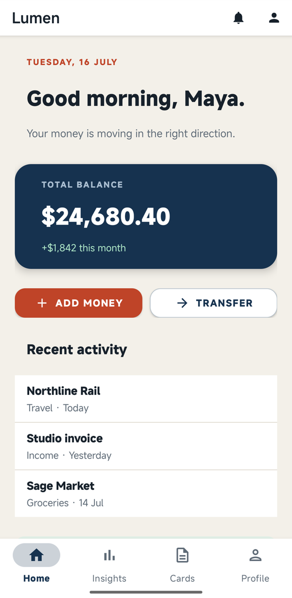
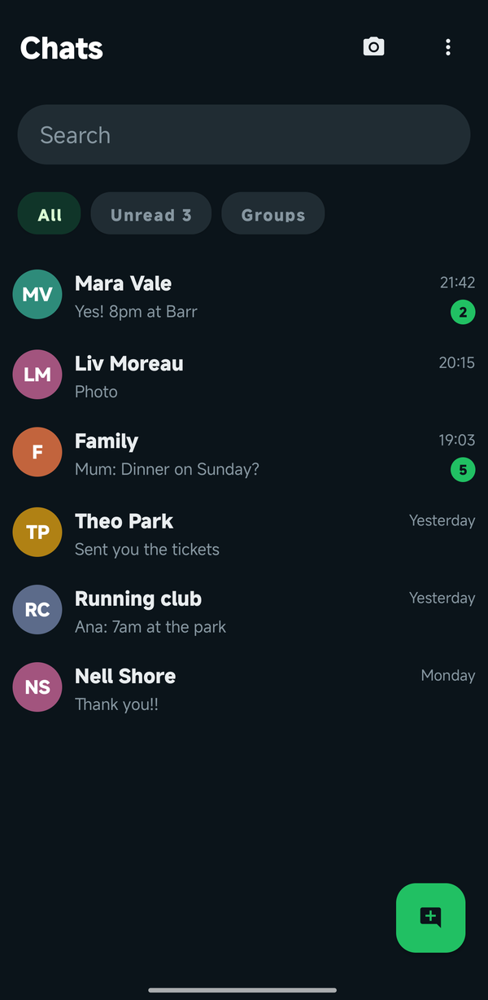
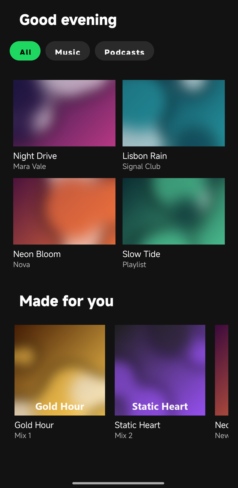
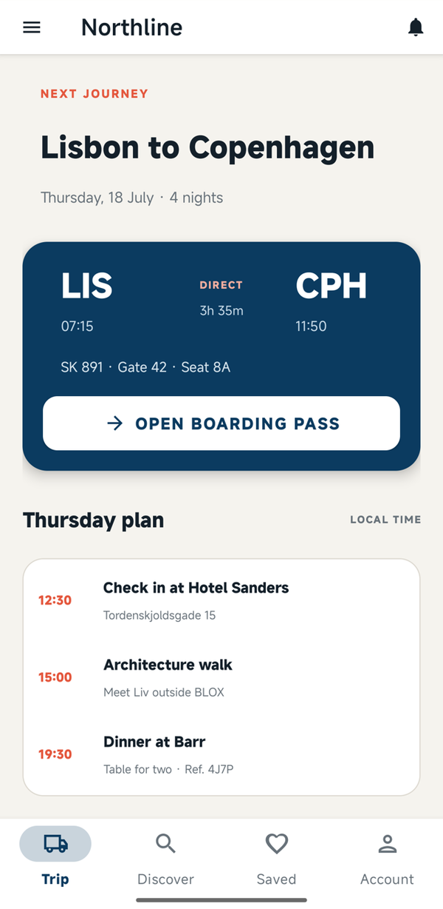

# ApkPy — build native Android apps in Python

**ApkPy is a Python package (`pip install apkpy`) that turns Python UI code into native Android Java and XML. The generated app does not bundle a Python interpreter and does not use a WebView.**

[](https://pypi.org/project/apkpy/)
[](https://python.org)
[](#license)
[](https://developer.android.com)

**[Website and documentation](https://repo-apkpy.pages.dev/)** ·
[Install](https://repo-apkpy.pages.dev/getting-started/) ·
[Showcase](https://repo-apkpy.pages.dev/showcase/) ·
[ApkPy vs Kivy, Flet and BeeWare](https://repo-apkpy.pages.dev/apkpy-vs-kivy-flet-beeware/) ·
[Can ApkPy build this?](https://repo-apkpy.pages.dev/can-apkpy-build-this/) ·
[Changelog](CHANGELOG.md)

<p>
  
  
  
  
</p>

Your Python is read at build time and turned into ordinary Android source —
`Activity` classes, layout XML, `res/` resources — so what installs on the
phone is a normal Android app. A small app ships at about 1.5 MB, signed and
shrunk with R8, and starts with no interpreter to boot.

You write the whole app in Python with a CSS-style stylesheet, see it on your
desktop in a live Previewer, and then build an installable `.apk` — or a
project to open in Android Studio. No Java, no Kotlin, no Android Studio needed.

## Quick start

```bash
pip install apkpy
apkpy start my_app        # a project with writehere.py, where the app lives
cd my_app
apkpy preview             # the app on your desktop, live
apkpy run --usb           # a native APK, installed on a phone over USB
```

`apkpy doctor` checks the Android toolchain and `apkpy setup` installs one.
`apkpy run --qr` installs over Wi-Fi, `apkpy build` writes an Android Studio
project, and `apkpy release` (or `--aab` for Google Play) signs a release.

## A first app

```python
from apkpy_lib import *

home = Screen(id="home")

TASKS = [
    {"id": "t1", "title": "Book the Porto train", "when": "Today"},
    {"id": "t2", "title": "Call the landlord", "when": "Today"},
    {"id": "t3", "title": "Renew the gym card", "when": "Friday"},
]


def done(item):
    toast("Done: " + item["title"])


label("My tasks", variant="title", screen=home)
chips(["All", "Today", "Later"], selected="All", screen=home)
virtual_collection(TASKS, template={"title": "{title}", "subtitle": "{when}"},
                   id="tasks", screen=home,
                   swipe_right=swipe("check", "Done", on_swipe=done))
button("Add task", icon="add", command=lambda: toast("New task"), screen=home)

run(start_screen=home, theme=Theme(primary="#6750A4"))
```

A recycled native list whose rows swipe away, filter chips, a Material button
and a theme — each one a real Android view on the phone. The theme has a dark
mode too: `appearance.set("system")` makes the app follow the phone.

## What you get

- **Native output.** Activities, layouts and resources you could have written
  by hand, built with Gradle. No interpreter, no WebView.
- **A live Previewer** on your computer, built to look and behave like the
  phone, so most of the work happens without a device.
- **Styling** with a CSS-like stylesheet and a `Theme` with light and dark
  modes, design tokens, flex and grid layouts, and animations.
- **Components:** virtualised lists and grids, rows that swipe and reorder,
  chips and segmented buttons, tabs that swipe, charts, form fields that show
  their errors, a photo viewer with pinch zoom, cards, bottom navigation,
  drawers, app bars, dialogs, bottom sheets that hold components, Markdown
  and rich text.
- **Device features from Python:** camera, NFC, Bluetooth, biometrics,
  contacts, location, sensors, notifications, in-app purchases, background
  jobs, SQLite, encrypted storage and HTTPS — with the permissions written
  for you.
- **Errors that explain the fix.** Anything ApkPy cannot translate stops the
  build with a code, the line and what to write instead
  ([friendly errors](https://repo-apkpy.pages.dev/friendly-errors/)).
- **Accessibility checks in every build:** missing descriptions, small touch
  targets and low-contrast text are reported before the app ships.
- **Your own Java** when you need something ApkPy does not wrap.

## What it does not do

It does not run Python on the device, so `pip` packages such as `requests`,
`numpy` or `pandas` cannot come along. ApkPy translates a
[documented subset of Python](https://repo-apkpy.pages.dev/compatibility/) and
gives you its own APIs (`https`, `db`, `files`, `background_job`) for the same
jobs. It builds for Android only. See
[where each framework wins](https://repo-apkpy.pages.dev/apkpy-vs-kivy-flet-beeware/)
for an honest comparison.

## Benchmark

The same 100-note app, debug builds, same emulator session
([method and raw data](benchmarks/README.md)):

| | Debug APK | Cold start | Memory (PSS) |
| --- | ---: | ---: | ---: |
| ApkPy | **5.37 MiB** | **2,565 ms** | **67.0 MiB** |
| BeeWare/Toga | 34.46 MiB | 5,536 ms | 83.4 MiB |

Signed and shrunk with R8, the ApkPy app comes to 1,518 KB.

## This repository

The ApkPy engine is closed source and installed from PyPI. This repository
holds everything around it:

| Folder | What is in it |
| --- | --- |
| [`examples/`](examples/) | Complete apps: 35 numbered examples, the showcase apps, rebuilt screens of apps you know, tutorials |
| [`releases/`](releases/) | The long release notes, one file per version |
| [`benchmarks/`](benchmarks/) | The benchmark apps, packaging files and raw measurements |
| [`CHANGELOG.md`](CHANGELOG.md) | Every change, version by version |

The documentation lives on the [site](https://repo-apkpy.pages.dev/), not in
this repository.

`apkpy examples` also drops a ready-made app into any folder.

## License

ApkPy is **proprietary software**. The source code is not open for
redistribution or modification. See [`LICENSE`](LICENSE) for full details.

The core compiler is not open source today, and there is no current plan to
publish it while ApkPy remains under active development and maintenance.
Open-sourcing may be considered later. If the maintainer ever decides to
permanently abandon ApkPy, the core source **will be released as open source**
so the project can be inspected, maintained and continued by others. Until
then, the current proprietary [`LICENSE`](LICENSE) remains in force; this
future commitment does not grant redistribution or modification rights today.
Read the complete
[project continuity policy](https://repo-apkpy.pages.dev/project-continuity/).

© 2025–2026 ApkPy. All rights reserved.

## Community

- **Found a reproducible bug or missing capability?**
  [Open an issue](https://github.com/apkpy-project/repo-apkpy/issues) with a
  minimal `writehere.py`, the versions and the full traceback or Logcat cause.
- **Need a first project?** Follow the
  [end-to-end tutorial](https://repo-apkpy.pages.dev/tutorial-end-to-end/) or
  copy a [showcase app](examples/showcase/).
- **Want to share an example?** Read [CONTRIBUTING.md](CONTRIBUTING.md).

GitHub Issues is the current public support channel.
