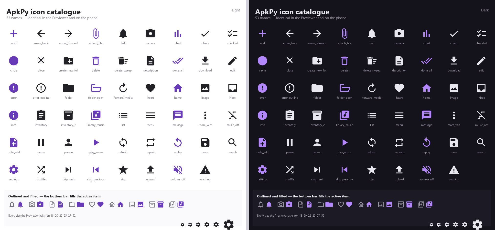

# ApkPy 1.3.2 — Persistent Tasks, Any-File Uploads & Deep Diagnostics

## Part 1 — Persistent tasks and the offline queue

ApkPy 1.3.2 adds work that outlives the screen that started it. A declared job
keeps running when the app goes to the background, when the network
disappears, when Android reclaims the process and across a reboot. The
generated APK still contains native Java, not a Python runtime, a WebView or a
polling loop.

## Small working example

```python
from apkpy_lib import Screen, background_job, button, inputs, label, run, storage

home = Screen(id="home")
message_input = inputs(placeholder="Write a message", id="message", screen=home)
queue_state = label("Queue · idle", id="queue_state", screen=home)


def deliver_message():
    outbox.progress(20, "Uploading")
    storage.set("last_message", outbox.input("text"))
    outbox.progress(100, "Delivered")


def queue_changed(status):
    queue_state.set_value(
        "Queue · " + status["state"] + " · pending " + status["pending"]
    )


outbox = background_job(
    "outbox",
    run=deliver_message,
    requires_network=True,
    retry="exponential",
    unique=True,
    on_conflict="append",
)

outbox.observe(on_change=queue_changed, screen=home)

button(
    "QUEUE MESSAGE", id="send", screen=home,
    command=lambda: outbox.enqueue({"text": message_input.get_value()}),
)

run(start_screen=home)
```

## What the generated Android app does

- WorkManager stores the queue in its own database, so pending work survives
  process death and a reboot with no code in the app.
- `requires_network`, `requires_unmetered`, `requires_charging` and
  `requires_battery_not_low` become an `androidx.work.Constraints` object; the
  system decides when the work may run.
- `retry="exponential" | "linear"` with `retry_seconds=` becomes
  `setBackoffCriteria`, honouring WorkManager's ten-second floor.
- `unique=True` with `on_conflict="append" | "keep" | "replace"` becomes
  `ExistingWorkPolicy`. `"append"` maps to `APPEND_OR_REPLACE` because plain
  `APPEND` cancels newly appended work after a failure, which would silently
  break an offline queue.
- `observe()` attaches to `getWorkInfosByTagLiveData(...)` rather than polling,
  so progress survives rotation and resumes with the Activity.

## Inside the job

| Call | Meaning |
| --- | --- |
| `job.input(key)` | a value passed to `enqueue({...})` |
| `job.attempt()` | which attempt this is, starting at `"1"` |
| `job.progress(percent, message)` | publish progress to observers |
| `job.retry()` | run again after the backoff |
| `job.fail()` | stop permanently |

`retry()` and `fail()` mark the attempt instead of jumping out, so the result
is identical in the Previewer and on Android. Add `return` to stop
immediately.

## Offline Outbox demonstration

`playground/writehere.py` queues messages, holds them while the machine is
offline, drains them in order when the connection returns, restores pending
work after a restart, exercises a deliberate failure with backoff, and cancels
the queue on demand.

## Measured conditional overhead

The same two-screen application was built twice with JDK 21, the same Android
SDK and Gradle 8.7, all 31 tasks executed:

| Control | Generated files | Generated source | Debug APK | Clean build |
| --- | ---: | ---: | ---: | ---: |
| Without `background_job` | 30 | 142,719 bytes | 5,652,259 bytes | 43.8 s |
| With `background_job` | 32 | 167,746 bytes | 6,068,041 bytes | 42.1 s |

The difference is **415,782 bytes (7.36%)**, almost entirely the WorkManager
library rather than generated code. Apps that never declare a job receive no
runtime class, no worker and no `androidx.work` dependency.

## Validation

- 177 transpiler regression checks passed;
- 21 focused Data Core and Reactive Data checks passed;
- 8 focused friendly-diagnostic checks passed;
- the generated Java compiled with Gradle into an installable debug APK;
- the Previewer was driven through queueing, offline hold, drain on
  reconnection, restart recovery, retry with backoff and cancellation.

## Fixed

- A `return` inside a generated worker emitted `return;` from `doWork()`,
  which returns `Result` and did not compile. This was a pre-existing defect
  that also affected `service.every`.
- Previewer connectivity now requires a route *and* an answer on port 443. A
  port-53 check reported offline on machines that block it; a route check alone
  reported online with the Wi-Fi off on machines with Hyper-V, WSL, VirtualBox
  or VPN adapters.
- Previewer job status values are strings, matching the generated `_jsonGet`
  accessor.
- Observer notifications raised on a worker thread are delivered through an
  interface-thread pump instead of stalling the queue.

## Deliberate limits

Periodic work stays with `service.every`. This release adds no cross-device
synchronization, conflict resolution or server component. The job body
supports the same background-safe subset as an existing worker: `storage`,
`db`, `https`, `notify` and plain logic.

`https` is synchronous inside the generated worker and asynchronous in the
Previewer, so an attempt's outcome must be decided in the job body rather than
in an `on_response` callback.

---

## Part 2 — Any file, and errors that explain themselves

## Small working example

```python
from apkpy_lib import Screen, label, run, upload_button

home = Screen(id="home")
status = label("Idle", id="status", screen=home)


def file_chosen(path, name, size, mime):
    status.set_value(name + " · " + size + " bytes")


def progress_changed(percent, sent, total):
    status.set_value("Uploading " + percent + "%")


def upload_done(success, response):
    status.set_value("Sent" if success else "Failed")


upload_button(
    "SEND A FILE",
    url="https://api.example.com/files",
    types=["pdf", "docx"],
    headers={"Authorization": "Bearer YOUR_TOKEN"},
    on_file=file_chosen,
    on_progress=progress_changed,
    on_result=upload_done,
    id="send", screen=home,
)

run(start_screen=home)
```

The primitive underneath it, for when the upload has to be conditional:

```python
def file_chosen(success, path, name, size, mime):
    if success and int(size) < 10000000:
        uploads.file("attachment", URL, path, on_result=upload_done)

files.pick(on_result=file_chosen, types=["pdf"])
```

## What the generated Android app does

- `ActivityResultContracts.OpenDocument` through the Storage Access Framework:
  **no storage permission**, no manifest change, no FileProvider entry, no new
  Gradle dependency.
- `types=` becomes `EXTRA_MIME_TYPES`, resolved in Python at build time — ApkPy
  never calls `MimeTypeMap`, whose tables differ between manufacturers.
- The `OpenableColumns` query runs off the interface thread, because a provider
  backed by Drive or OneDrive can block on the network answering it.
- `upload_button` is expanded at parse time into an ordinary button plus two
  callbacks, so the generated Java is identical to the hand-written form. A
  regression test asserts that equality.

## Diagnostics

**64 codes across eight families.** Measured against every message the library
raises: 166 of 167 are matched by a specific rule. Each diagnostic now carries a
`Why this happened` section and a `Read more` link.

- Gradle failures are diagnosed instead of leaving a wall of log: eight
  recognised signatures, and `Received` leads with the line naming the file,
  position and reason.
- Compiler errors point at the line in `writehere.py` rather than ApkPy's own
  source, and never report a location inside the library.
- A search filter that cannot become a `TextWatcher` is reported as `C4002`
  rather than a one-line note — the Previewer would keep filtering while the
  APK silently would not.
- A background job body that raises is reported with the job name, attempt
  number and payload keys.

## Fixed

- `db.text(choices=[...])` generated `new JSONArray(String)`, whose checked
  `JSONException` the field initialiser neither caught nor declared, so any
  model using `choices=` failed the build with *unreported exception
  JSONException*.
- Upload progress delivered integers in the Previewer and strings on Android,
  so `"Uploading " + percent + "%"` worked on the phone and raised `TypeError`
  on the desktop. Both runtimes now deliver strings; compare with
  `int(percent)`.
- Upload lambdas could shadow an enclosing parameter, producing Java that did
  not compile.
- Diagnostic output is normalised to ASCII for legacy Windows code pages.

## Deliberate limits

The picker returns one file; `multiple=True` is not in this release.
`takePersistableUriPermission` is not requested, because the `OpenDocument`
grant already outlives a pick-then-upload flow and persisted grants are a scarce
per-app resource. A picked `path` is an opaque handle whose supported consumers
are the `uploads.*` helpers; it cannot be displayed with an `image` component.

When a document provider does not report a size, Android shows 0% for the
transfer and then jumps to 100%. Fixing that needs an indeterminate-progress
contract that would change the already published `uploads.*` behaviour, so it is
held back.

## Validation

- 185 transpiler regression checks passed;
- 21 focused Data Core and Reactive Data checks passed;
- 21 focused friendly-diagnostic checks passed;
- 23 focused file-picker and upload checks passed;
- 83 focused unit tests passed in total;
- the generated Java compiled with Gradle into an installable debug APK;
- the Previewer was driven through picking, filtering, cancellation and upload.

---

## Part 3 — Icons and motion

ApkPy had two unrelated icon systems, a hand-drawn Tk one and a vector one,
sharing 29 of their 48 names. Geometry now lives in one shared module both
backends read, the Previewer rasterises it with antialiasing, and `icon=`
accepts your own `.svg`.



Motion moved onto one dial. `Theme(motion="subtle")` calms the whole app;
`motion="none"` switches it off. Components fade instead of popping, the bottom
bar fills its active item, and screens can slide.

Along the way this closed several silent disagreements between the two
runtimes: `animation-duration: 0.5s` meant 0.5 ms on one side and 5 ms on the
other, `scale` animated only on the phone, dark-theme fades flashed white, and
a cleared input never got its placeholder back on the desktop.

Full notes: https://repo-apkpy.pages.dev/version-1.3.2/
