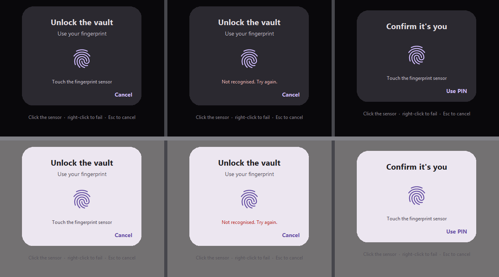

# ApkPy 1.5.0 — The same words on both sides

Two things that turned out to be one: **the fingerprint check**, and **the two
renderers agreeing** about the words they share.

Every change is one of two things. It either gives a name to something that
never had one — a step on a type ramp, a plane between the background and the
surface — or it repairs a place where the Previewer and the Android generator
had quietly chosen different numbers for the same idea.

Those turn out to be the same thing. A value with no shared name is a value
each side is free to guess at, and both sides guessed reasonably. That is
precisely why nobody noticed.

---

## Part 1 — The fingerprint check

```python
def unlocked(ok, reason):
    if ok:
        on_click_navigate(vault)
    else:
        toast(reason)

biometrics.unlock(title="Unlock the vault", subtitle="Use your fingerprint",
                  cancel_text="Use password", on_result=unlocked)
```



**Android draws this dialog itself.** An app supplies three strings and the
platform draws the rest, which is why those three strings are the whole API.

`on_result` receives `(success, reason)`, and `reason` is `"ok"` or one of
`cancelled`, `no_hardware`, `not_enrolled`, `unavailable`, `lockout`,
`failed` — never empty. Both runtimes read one table, and the generated Java's
`switch` is emitted from it.

The status is checked **before** the dialog is built, so a phone with no sensor
gets `no_hardware` instead of a prompt that cannot succeed. `allow_pin=True`
adds the device credential and drops the cancel button, because
`PromptInfo.Builder` throws if both are set. A scan that does not match is not
a result: the prompt stays open, on both runtimes.

Verified on a Pixel 9 Pro emulator: `not_enrolled` with no finger registered,
the PIN sheet, a real fingerprint, and the cancel button — all four reporting
the word the table says.

---

## Part 2 — A vocabulary for size

### Seven steps instead of seventeen guesses

Across the 25 shipped examples there were **17 distinct font sizes**, with
13px, 14px and 15px accounting for 32 uses between them — the same intent
written three ways, in three files, on three different days.

```css
title   { font-size: var(--text-2xl); line-height: var(--leading-tight); }
body    { font-size: var(--text-lg);  line-height: var(--leading-normal); }
caption { font-size: var(--text-sm);  color: var(--text-secondary); }
```

| Token | Default | Typical use |
| --- | --- | --- |
| `--text-xs` | 11px | overline, timestamps, a tab label |
| `--text-sm` | 12px | captions, helper text under a field |
| `--text-base` | 14px | dense list rows |
| `--text-lg` | 16px | body text — what `label()` uses when asked nothing |
| `--text-xl` | 20px | a section heading |
| `--text-2xl` | 24px | a screen title |
| `--text-3xl` | 32px | a number to be read across the room |

The steps are **Material's own sp values, not a geometric series**. One ratio
lands on 29.3 where the platform says 32, and each renderer rounds it
differently — which is exactly the class of invisible disagreement this
release exists to remove.

`--leading-tight`, `--leading-normal` and `--leading-loose` are 1.2, 1.45 and
1.7. `line-height` already read a bare number as a multiple of the font size
on both sides, so the multipliers ride on machinery that was already correct.

### One edit instead of seventeen

```python
run(start_screen=home, theme=Theme(font_size=18))
```

A heading that was 20sp becomes 26sp, body text 21sp, a display number 41sp.
An app made for older eyes stays proportional.

---

## Part 3 — A vocabulary for depth

A card has to sit *on* a surface. A well has to sit *under* one. A divider
should separate without shouting. None of the three had a name.

```css
sheet { background-color: var(--surface-high); }
well  { background-color: var(--surface-low); }
group { divider-color: var(--border-subtle); divider-width: 1px; }
```

When the app declares its own `surface`, `background` or `border`, all three
are **derived from those colours** rather than falling back to Material's
palette. This is not a nicety: a warm theme that borrowed a cold grey plane
would grow a slab of somebody else's design in the middle of it.

| Token | How it is derived |
| --- | --- |
| `--surface-high` | the surface, 6% toward the text |
| `--surface-low` | 55% of the way from the surface to the background |
| `--border-subtle` | 35% from the surface toward the border |

That last number is not invented. Material places `outlineVariant` at roughly
35% of the way from surface to outline in **both** modes. An earlier draft
that pulled the divider toward the *background* produced three levels of
contrast — which is not a faint line, it is no line at all.

Like every other theme colour, all three are written as resource references,
so `values-night/` answers them and `appearance.set()` moves them at runtime.

> **A subtle divider is not always the better one.** If a theme's `border`
> already sits close to its surface, it is already playing the quiet role and
> there is no room underneath it. The bundled `writehere.py` is one such
> theme — `--border-subtle` made its rows float, so it still uses `--border`.
> Render it and look before you swap.

---

## Part 4 — Two renderers that disagreed

### Body text was two different sizes

`label("Hello")`, with no stylesheet at all, drew at **14px in the Previewer
and 16sp on Android**.

Two literals, written into two files at different times, each defensible on
its own. It survived because "body text" never had a shared name for the two
sides to disagree *about* — there was nothing to compare, so nothing looked
wrong. It is the most used component in the library, so the gap was in every
app ever built with it.

Both sides now read `--text-lg`. **The phone's number wins**, so no compiled
app changes.

### The active tab was wearing three badges

Material's `Widget.MaterialComponents.BottomNavigationView` points
`itemTextAppearanceActive` **and** `itemTextAppearanceInactive` at the same
`textAppearanceCaption` — 12sp, weight normal. On the device the active tab's
label differs only in **tint**; the state is carried by the pill behind the
icon and by the icon filling in.

The Previewer was bolding it as well — a third signal the phone does not have
— and asking Tk for ten *points*, which is 13.3px at 96dpi where the phone
renders 12sp.

Previewer-only: the generated XML is unchanged.

> **Five nav icons ship no outlined variant, and that is correct.** `search`,
> `list`, `chart`, `inbox` and `checklist` measure between 0.139 and 0.167 ink
> coverage, at or below the lightest of the 13 outlined variants (0.161). They
> **are** outlines already, and Material has one glyph for them too. Their tab
> still fills, tints and shows the pill.

---

## Part 5 — Guard rails

### `U2031` — a token in the wrong kind of slot

`--text` is a colour. `--text-lg` is a size. Three characters apart.

```css
title { font-size: var(--text); }     /* U2031 */
title { color: var(--text-lg); }      /* U2031 */
```

A size in a colour slot dies in `parseColor` when the screen opens, which at
least tells you something. A colour in a size slot is worse: `#211F26`
silently becomes 21px and the app just looks wrong.

A composite value such as `0 3px 8px var(--border)` is left alone.

### `U2029` — a property no renderer reads

`frobnicate: 3px` used to transpile clean, and so did `elevation`,
`transform`, `overflow` and `background` — four names reached for out of
browser habit, all dropped when the layout was written. That reads as the
*value* not working rather than the *name* not existing, which is why it went
unnoticed. It is a warning, not a failure.

The full stylesheet vocabulary is now a table in the docs, generated from the
same set both renderers read, so it cannot drift. **87 properties.**

---

## Also fixed

- `box-shadow` on a `container` drew a shadow in the Previewer and nothing on
  the phone — the container branch never asked for `android:elevation`.
- A `ViewGroup` clips its children to its padding box, so a shadow was drawn
  and then cut off exactly where it starts. Parents of anything that asks for
  a shadow, and the screen root, stop clipping.
- `padding` with three or four values reached the Previewer whole and the
  compiler truncated it to two: `padding: 0 20 24 20` came out as
  `0 20 0 20`, and the bottom silently disappeared.
- `padding-top`, `padding-right`, `padding-bottom` and `padding-left` were
  read by neither renderer despite appearing in the shipped examples.

---

## Verification

| Suite | Count | At 1.4.0 |
| --- | ---: | ---: |
| Transpiler harness (`playground/transpile_tests.py`) | 256 | 256 |
| Feature tests (`tests/features`) | 515 | 380 |
| Core tests (`tests`) | 35 | 21 |

All 25 examples transpile. The new tokens appear in **no** layout and **no**
drawable of any of them — only in the two colour tables, which is what an
opt-in token is supposed to do.

`res/values/apkpy_theme.xml` and `res/values-night/apkpy_theme.xml` each carry
`apkpy_surface_low`, `apkpy_surface_high` and `apkpy_border_subtle`, with
different values per table.

The bottom bar was rendered and inspected in **both modes, on all three tabs,
before and after** — because a test can confirm that a label is not bold, and
cannot confirm that the bar looks right.

---

## Upgrading

```powershell
python -m pip install --upgrade apkpy
```

Nothing in 1.5.0 requires a change to an existing app. The tokens are opt-in,
and an app that names none of them generates the project it generated on
1.4.0.

Three behaviours changed without an opt-in, all three because they were
defects:

1. An app that uses `card` now gets the `box-shadow` its theme has always
   declared — it was being clipped away, so cards will look slightly
   different. They now look the way they always asked to.
2. `padding` with three or four values now applies what it names on the phone.
   A layout silently missing its bottom padding will gain it.
3. The bottom bar's active label is no longer bold in the Previewer. If you
   were reading that boldness as the state signal, the pill and the filled
   icon carry it — and always did on the phone.
