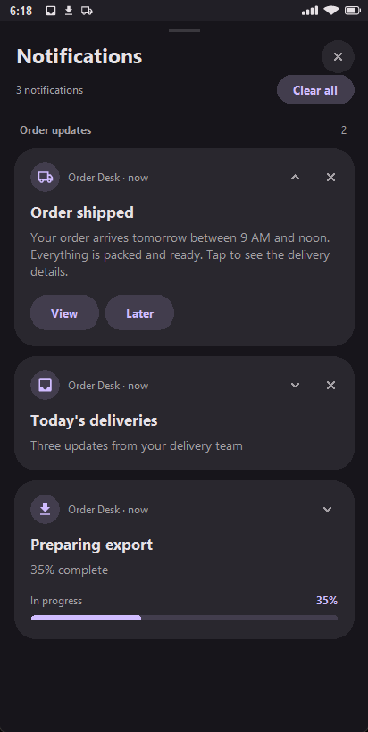
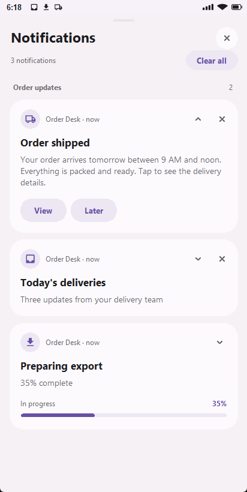
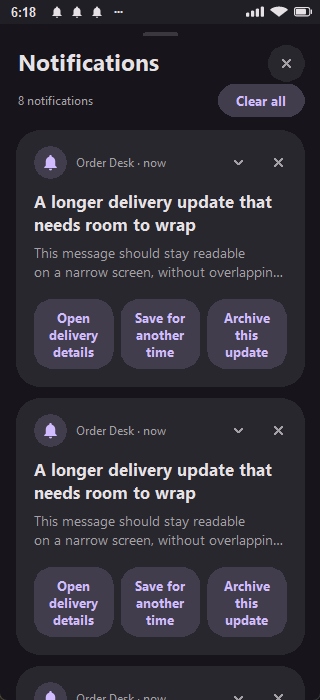
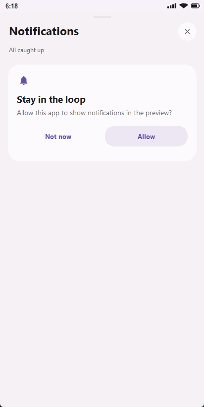
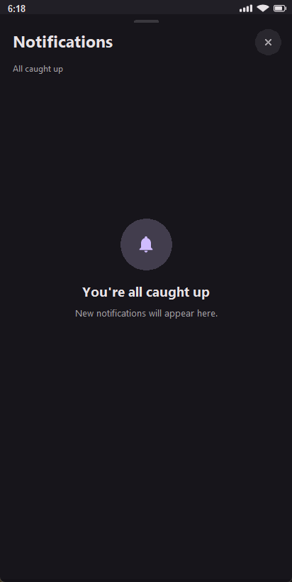

# Notifications that stay in the drawer

!!! info "Available in ApkPy 1.7.0"

    The existing `notify(title, message, id)` form is unchanged. The extended
    arguments and `notifications` object require ApkPy 1.7.0 or newer.

Use notifications for delivery updates, completed exports, background jobs
and inbox summaries. They are not dialogs: the person can leave them in the
drawer and return to your app later. No Python runtime is added to the APK.

## Complete example: a delivery update

Copy this into `writehere.py`. Run it, choose **Allow notifications**, then
**Send update**. In the Previewer, click the clock/status strip to open the
drawer; on Android, open the system notification drawer.

```python
from apkpy_lib import (
    Screen, Theme, app_bar, label, button, run, notify, notifications,
    on_click_navigate, toast,
)

home = Screen(id="home", scroll=True)
detail = Screen(id="detail", scroll=True)
app_bar("Order Desk", screen=home)
app_bar("Delivery details", screen=detail)
status = label("No update sent", screen=home)
label("Order #42 arrives tomorrow, 9 AM to noon.", screen=detail)

notifications.channel("orders", "Delivery updates", importance="high")


def view_action():
    notifications.cancel("order_42")
    status.set_value("Order #42 opened")
    on_click_navigate(detail)


def later_action():
    notifications.cancel("order_42")
    status.set_value("Notification cleared — no reminder scheduled")
    toast("Notification cleared. Check the order later.")


def go_home():
    on_click_navigate(home)


def dismissed():
    status.set_value("The update was dismissed")


def send_update():
    notify(
        "Order shipped",
        "Your order arrives tomorrow between 9 AM and noon. "
        "Expand this card to read the full delivery update.",
        id="order_42",
        channel="orders",
        icon="local_shipping",
        style="big_text",
        actions=[("View", view_action), ("Later", later_action)],
        on_tap=detail,
        on_dismiss=dismissed,
        group="orders",
    )


def request_permission():
    notifications.ask()


def check_permission():
    if notifications.allowed():
        status.set_value("Notifications are allowed")
    else:
        status.set_value("Notifications are disabled")


def clear_order():
    notifications.cancel("order_42")


button("Allow notifications", command=request_permission, screen=home)
button("Check permission", command=check_permission, screen=home)
button("Send update", command=send_update, screen=home)
button("Cancel update", command=clear_order, screen=home)
button("Back to Order Desk", command=go_home, screen=detail)
run(start_screen=home, theme=Theme(mode="dark"))
```

In this example, **View** opens the details and removes the card. **Later**
removes the card and shows a confirmation; it does not schedule a reminder.
The callbacks explicitly cancel the card: actions do not automatically cancel
every notification, so other apps can keep reusable actions.

An action is an ordinary zero-argument callback. `on_tap` accepts a callback
or a declared `Screen`. On Android an action opens the Activity that posted
the notification; a worker uses the initial Activity. A `Screen` target opens
that specific screen. Callbacks work with an already-open Activity and when
Android creates a new one from the notification.

`on_dismiss` is different: dismissing a notification **does not launch the app**.
If its Activity is active, the callback runs there. Otherwise Android saves
the event privately and delivers it when that Activity resumes. Do not use
this callback for time-critical background work. Programmatic `cancel()` and
`cancel_all()` do not call `on_dismiss`.

## API reference

```text
notify(title, message, id="apkpy_notification", *,
       channel="apkpy_default", icon="notifications", style="none",
       picture=None, lines=None, actions=None, on_tap=None, on_dismiss=None,
       ongoing=False, progress=None, group=None, when=None)
```

Posting submits an update; it does not return a delivery receipt. In particular,
`notifications.allowed()` does not guarantee that Android will display a
heads-up banner, play a sound or allow the chosen channel.

| Argument | Default | Meaning |
| --- | --- | --- |
| `title`, `message` | required | Notification heading and body |
| `id` | `"apkpy_notification"` | Reusing an ID replaces that card; different IDs accumulate |
| `channel` | `"apkpy_default"` | Declare custom channels before posting |
| `icon` | `"notifications"` | Literal name from the shared icon catalogue; Android uses a monochrome small icon |
| `style` | `"none"` | Literal `none`, `big_text`, `big_picture` or `inbox` |
| `picture` | `None` | Local image or Android `content://` URI; only for `big_picture` |
| `lines` | `None` | List of strings; only for `inbox` |
| `actions` | `None` | Up to three `(label, zero_argument_callback)` pairs |
| `on_tap`, `on_dismiss` | `None` | See callback behavior above |
| `ongoing` | `False` | Marks an in-progress notification; does not start a foreground service |
| `progress` | `None` | Number from 0 to 100 or `"indeterminate"` |
| `group` | `None` | Shared group key; two or more active cards get an Android summary |
| `when` | `None` | Epoch UTC **milliseconds**; omitted means now, not scheduled delivery |

Only `title`, `message` and `id` may be positional. The remaining arguments
are keyword-only. Callbacks, action lists, icon names, styles and channel
importance are declared statically; titles, messages, IDs and progress can
come from your app's state. A local literal picture is bundled relative to
the project directory. Dynamic filenames refer to files on the device.
HTTP image URLs are not downloaded by `notify`.

| Method | Behavior |
| --- | --- |
| `notifications.channel(id, name, importance="default")` | Create a channel, or update its display name |
| `notifications.allowed()` | Boolean app-level permission snapshot; not proof a particular channel is enabled |
| `notifications.ask()` | Ask for notification permission from a screen on Android 13+; simulated choice in Previewer |
| `notifications.cancel(id)` | Remove that card, including one marked ongoing |
| `notifications.cancel_all()` | Remove cards posted by this API and its push integration, not unrelated media/service notifications |

### Permission and channel rules

- APK generation adds `POST_NOTIFICATIONS` only when this feature or push is
  used. The Android 13+ request uses the Activity Result API.
- The first Activity `notify()` also requests permission if needed and queues
  the update until the decision. Prefer asking after an explicit button tap.
  A worker cannot display a permission prompt; request it in your screen first.
  The Previewer starts with simulated permission enabled; use `ask()` to
  rehearse allowing or denying it without touching the computer's permissions.
- `importance` is `min`, `low`, `default` or `high`. High permits heads-up
  display, but Android's channel settings, Do Not Disturb and device policy
  have the final say. A high channel does not guarantee sound or a popup.
- **Importance is fixed when a channel is first created.** Calling
  `channel("orders", ..., importance="high")` after creating `orders` as low
  does not raise it. The person can change settings, or your app can declare
  a genuinely different channel with a new ID.
- `ongoing=True` is a native flag, not a promise that users cannot dismiss a
  card. Android 14+ lets people swipe away many ongoing notifications while
  unlocked. The Previewer protects ongoing cards from its dismiss controls.
  See [Android's ongoing-notification change](https://developer.android.com/about/versions/14/behavior-changes-all#non-dismissable-notifications).

### Callback signatures and cancellation

| Callback | Signature | What it should do |
| --- | --- | --- |
| An entry in `actions` | `handler()` | Explicitly navigate, update state, cancel, or start supported work |
| `on_tap` | `handler()` or a declared `Screen` | Open the relevant content |
| `on_dismiss` | `handler()` | Handle a user dismissal; may be deferred until its Activity resumes |
| `background_job(..., run=task)` | `task()` | Execute the job; it does not receive `job` and `payload` parameters |

Pass the function itself, not `handler()`, in an action declaration. The words
**View** and **Later** are just labels: ApkPy does not infer navigation or
scheduling from them. The complete example implements their behavior explicitly.
An action does not cancel a reusable card automatically. Use
`notifications.cancel(id)` inside its callback when that is the intended result.
Programmatic cancellation does not emit a user-dismissal callback.

## Inbox and progress variants

Add these callbacks to the first example and bind them to buttons. A group
summary appears once at least two IDs in the same group are active.

```python
def send_digest():
    notify("Today's deliveries", "Three order updates", id="digest",
           channel="orders", icon="inbox", style="inbox", group="orders",
           lines=["#42: shipped", "#43: packing", "#44: delivered"])


def show_export():
    notify("Exporting", "35% complete", id="export",
           progress=35, ongoing=True, icon="download")


def finish_export():
    notify("Export complete", "Ready to open", id="export",
           progress=100, ongoing=False, icon="check")


def waiting_export():
    notify("Preparing export", "Waiting for data", id="export",
           progress="indeterminate", ongoing=True, icon="download")
```

`progress` only displays a value; it does not perform the export. Updating
the same ID preserves one notification rather than adding another card.

## Picture chosen by the user

This standalone example uses the gallery result as the image source. Android
decodes notification pictures on a background executor and downsamples large
images. A missing literal asset fails generation with a diagnostic; an
unreadable runtime URI is logged as `Notification invalid_picture` and is
not posted. Cancelled or superseded image loads cannot post an old card.

```python
from apkpy_lib import Screen, button, gallery, label, notify, run

home = Screen(id="home")
status = label("Choose a picture", screen=home)


def chosen(success, path):
    if success:
        notify("Selected picture", "Expand to view", id="photo",
               style="big_picture", picture=path, icon="image")
        status.set_value("Picture submitted")


def choose():
    gallery.pick(on_result=chosen)


button("Choose picture", command=choose, screen=home)
run(start_screen=home)
```

The Previewer can load desktop files, not Android `content://` URIs. A
bundled picture is demonstrated in the downloadable lab project below.

## Notify when a background job finishes

This is a complete example. The job runs off the UI thread and posts a native
notification; it does not call an Activity or attempt to ask for permission.

```python
from apkpy_lib import Screen, button, background_job, notify, notifications, run

home = Screen(id="home")


def request_permission():
    notifications.ask()


def task():
    notifications.channel("work", "Background work", importance="low")
    if notifications.allowed():
        notify("Work complete", "The queued task finished", id="completed",
               channel="work", icon="check")


# run callbacks receive no positional arguments in Previewer or Android.
worker = background_job("notification_task", run=task)


def start_work():
    worker.enqueue({})


button("Allow notifications", command=request_permission, screen=home)
button("Start work", command=start_work, screen=home)
run(start_screen=home)
```

## Firebase push

`push.listen(auto_notify=True, channel_id=..., channel_name=...)` uses the
same native publisher for messages handled by ApkPy's Firebase service.
`push.simulate()` uses the same persistent Previewer model. `auto_notify=False`
keeps automatic cards off; your own callback can call `notify()` explicitly.

Firebase **notification payloads** received while the app is in the background
can be displayed by the Firebase SDK itself. To control all presentation in
your app, use data-only messages and handle them appropriately; delivery still
depends on FCM and Android policy. This change does not supply Firebase
credentials, a server, or a guarantee of delivery. See the
[Firebase guide](push-firebase.md).

## Previewer controls and honest limits

The preview drawer is an overlay inside the existing device window: **no new
Toplevel**. Click/drag the status strip down to open it, use the chevron to
expand a card, and swipe up or press Escape to close. Tap an action to run its
callback. Swipe a card sideways or use its × to dismiss it. Clear all keeps
ongoing cards. Calling `cancel_all()` explicitly removes them too.

The header stays visible while the cards scroll. Actions have full button-sized
hit areas, long labels wrap, and expanded cards show the complete message.
Light and dark surfaces follow the app theme; this Previewer styling does not
replace Android's system-controlled notification appearance.

### Redesigned desktop drawer

- Rounded cards use a separate title, body and app/time line, with a soft icon
  background. Collapsed long messages show a two-line excerpt; expand to read more.
- Use the mouse wheel over the cards to scroll. **Notifications**, the card
  count, close and **Clear all** stay in the fixed header. Updating a card keeps
  the scroll offset where possible, clamped if the content becomes shorter.
- Action pills are clickable across their entire background, not only on the
  letters. Their labels wrap on compact screens instead of overflowing.
- Progress uses a rounded track and percentage, or an animated indeterminate
  segment. These are display states, not an actual download/export operation.
- Expanded picture cards preserve the image aspect ratio. Inbox lines receive
  their own rows. Wide windows center the cards instead of stretching them
  across the whole viewport.
- Empty drawers and simulated permission requests have their own explanatory
  states. There is no extra notification popup window to manage.

No new styling argument is required: use the app's existing `Theme(mode="dark")`
or `Theme(mode="light")` and theme tokens. The drawer follows them automatically.
Its colours and shape are a desktop design, not a pixel-identical recreation
of the notification shade on every Android brand.

High-importance heads-up cards stay for approximately four seconds. Only
that temporary banner disappears: the notification remains in the drawer.
The status strip shows up to three notification icons and an overflow mark.

| Behavior | Previewer | Android |
| --- | --- | --- |
| Drawer and cards | Drawn inside the device; theme tokens | System notification UI; appearance varies by Android/device |
| Actions, tap, progress and grouping | Simulated with real Python callbacks | Native notifications and immutable PendingIntents |
| Permission | Local simulated choice | Actual app permission and channel settings |
| Sound/vibration | No | Subject to channel and device settings |
| Lock screen | Not simulated | Subject to device privacy/settings |
| Survives app process closing | No | Normally yes; force-stop, uninstall and system policy are exceptions |
| Tap opens a closed app | Only while the preview process runs | Yes, through the Activity PendingIntent |
| Ongoing dismissal | Protected in preview | Version/device dependent; Android 14+ allows some swipes |
| Dismiss callback while app is closed | Preview process must run | Queued until its Activity resumes; no forced launch |

### Actual Previewer screenshots

These are captures of the running Tk renderer, not design mockups.

{ width="320" }
{ width="320" }

Compact labels, the permission prompt and the empty state were checked too:

{ width="240" }
{ width="260" }
{ width="260" }

[View the wide-layout capture](../assets/notifications/preview-wide.png).

## Troubleshooting

| Symptom | Check |
| --- | --- |
| Nothing appears | App permission, channel settings and the channel declaration; inspect `Notification not_allowed` in Logcat |
| Importance change seems ignored | Channels keep their original importance; see the rules above |
| Cards overwrite one another | Use different IDs; the legacy default intentionally updates one card |
| Action never runs | Use a declared zero-argument function or zero-argument lambda, not a function call |
| View appears to do nothing | The callback must do something visible, such as navigate; changing only a hidden status label can be easy to miss |
| Later does not remind me later | Its label does not schedule work; the lab explicitly clears the card without scheduling a reminder |
| `task() missing ... job ... payload` / `P3008` | Declare `def task():` for `background_job(..., run=task)`; the callback receives no positional arguments |
| `C1710` during generation | Check the named argument, literal style/icon, maximum of three actions and callback declaration; the diagnostic points at the declaration |
| Dismiss callback runs later | Its Activity was not active; dismissal does not force it to open |
| Picture does not appear | Local readable asset/path or granted content URI, and `style="big_picture"`; no HTTP URL |
| Four actions fail generation | Android supports at most three; combine or move secondary actions into the app |
| Worker cannot ask permission | Ask from a screen before starting background work |
| A high-priority preview banner disappears | It expires after about four seconds; open the drawer to see the persistent card |
| Preview looks unlike the phone | Android owns its system UI; only the desktop drawer follows ApkPy's theme |

RemoteViews, bubbles, conversation shortcuts and notification scheduling are
not included. Media notifications continue to use the existing audio feature.

## Runnable lab

[Download the complete Order Desk project](../downloads/notifications/notification-lab.zip)
or [read its app code](../downloads/notifications/notification-lab.py).
The project includes `apkpy.toml` and its local picture, with no library source.
It exercises all four styles, two actions, a Screen tap, dismissal, grouping,
progress updates, permission controls and a WorkManager job.

### What each lab control should do

| Control or gesture | Expected result |
| --- | --- |
| Allow notifications | Preview: simulated choice; Android 13+: request when allowed by the system's permission state |
| Check permission | Update the app's status with the app-level permission snapshot |
| Send order update | Post/update `order_42`; expand to see the full message and View/Later |
| View, or tap the order card | Open the Order #42 details and remove the non-ongoing card |
| Later | Remove the order card and show confirmation; **no reminder is scheduled** |
| Swipe away the order / its dismiss control | Remove it and deliver the user-dismissal callback under the lifecycle rules above |
| Send inbox digest | Post `digest`; expand for its three lines; grouped with the order when both exist |
| Send picture | Post the bundled local picture; expand to view it |
| Show progress, then Finish progress | Update the same `export` card from 35%/ongoing to 100%/complete |
| Run background task | Queue the zero-argument task; it posts `worker` when it runs |
| Clear notifications (app button) | Cancel all notifications owned by this publisher, including ongoing cards |
| Clear all (Previewer header) | Dismiss only removable preview cards; ongoing cards stay |

The download contains example application code only. Run it with ApkPy 1.7.0
or newer; 1.6.1 does not provide the extended API.

## Verification and recent fixes

The notification work was checked in the desktop renderer, generated Java and
on a physical Android 16 / API 36 device. These are different kinds of evidence:

- Desktop: real Tk event dispatch for status-strip and action clicks, narrow
  (320px) and wide (620px) layouts, long labels, fixed header, scroll preservation,
  empty/permission states, pictures, inbox and animated progress. Both dedicated
  Previewer scripts passed; screenshots above come from those runs.
- Regression checks after the visual refresh: 970 feature tests, including
  21 notification tests, and 258 transpiler checks passed. All four Python
  blocks in this guide generated Android Java/XML.
- Native: the Notification Lab built with Gradle; 39 instrumentation checkpoints
  passed. Separate taps on **View** and **Later** in the phone's actual system
  drawer confirmed navigation/cancellation and visible confirmation respectively.
- Firebase: generated integration code compiled with Gradle, but real remote
  delivery was **not tested** without a configured Firebase project.

The lab's background callback was corrected from `task(job, payload)` to `task()`.
Its View/Later actions now have visible, explicit behavior. A separate compiler
fix prevents screens with different button styles from overwriting a shared
drawable filename, which had made the permission button's label invisible.
Worker helpers now use an application Context, and bundled notification
pictures go into Android assets. The desktop visual refresh does not alter the
phone's system-notification styling.

This is not a certification across Android versions or manufacturers. Previewer
tests cannot establish phone permissions, lock-screen behavior or FCM delivery.
Use the [1.7.0 release notes](../version-1.7.0.md) for the complete update.
