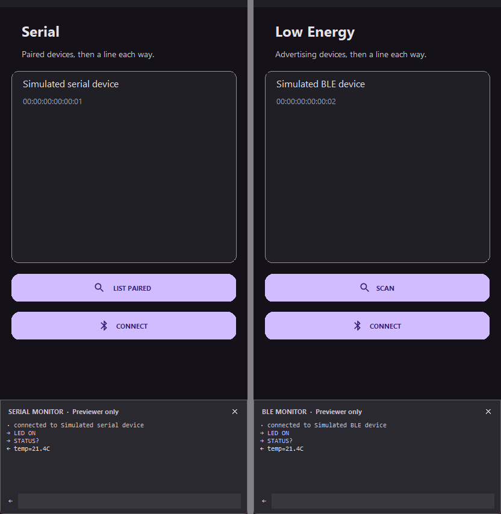
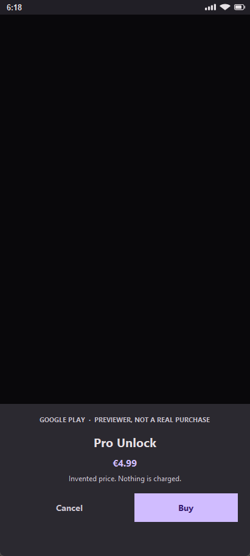

# Native Android features

Task guides: [Firebase push](guides/push-firebase.md),
[streaming uploads](guides/uploads.md) and
[maps with continuous location](guides/maps-tracking.md).

## Permissions

Declare permissions before running the app:

~~~ python
declare_permissions([
    "android.permission.CAMERA",
    "android.permission.ACCESS_FINE_LOCATION",
])
~~~

Request dangerous permissions at runtime:

~~~ python
def permission_result(granted):
    if granted:
        toast("Permission granted")
    else:
        toast("Permission denied")

permissions.request(
    "android.permission.CAMERA",
    on_response=permission_result,
)
~~~

Only request permissions when a user action needs them, and explain the reason in the interface.

## Notifications and sharing

~~~ python
notify("Download complete", "Midnight Drive is available offline")
share("Listen to Midnight Drive", title="Share track")
clipboard.copy("https://example.com/track/42")
~~~

<code>notify</code> creates a system notification. <code>toast</code> is for brief in-app feedback. <code>snackbar</code> is useful when the message belongs to the current screen and may include an action.

## Camera and gallery

~~~ python
def image_selected(success, path):
    if success:
        avatar.set_value(path)

camera.capture(on_result=image_selected)
gallery.pick(on_result=image_selected)
~~~

The Previewer uses a file picker to simulate the flow. Android opens the native camera or content picker.

<code>camera</code> and <code>gallery</code> are image-only. For documents, archives, audio or anything else use <code>files.pick</code>, or <code>upload_button</code> to pick and send in one step:

~~~ python
def file_chosen(success, path, name, size, mime):
    if success:
        chosen.set_value(name + " - " + size + " bytes")

files.pick(on_result=file_chosen, types=["pdf", "zip"])
~~~

See [Streaming multipart uploads](guides/uploads.md).

## Biometrics

~~~ python
from apkpy_lib import Screen, biometrics, button, label, on_click_navigate, run, toast

home = Screen(id="home")
vault = Screen(id="vault")

label("Your notes are locked", id="t", screen=home)
label("Here they are", id="v", screen=vault)

def unlocked(ok, reason):
    if ok:
        on_click_navigate(vault)
    else:
        toast(reason)

def ask():
    biometrics.unlock(
        title="Unlock the vault",
        subtitle="Use your fingerprint",
        cancel_text="Use password",
        on_result=unlocked,
    )

button("UNLOCK", id="go", icon="lock", screen=home, command=ask)
run(start_screen=home)
~~~

`USE_BIOMETRIC` is declared for you, and `androidx.biometric` is added to the
Gradle build only for an app that asks for the prompt. An app that never
mentions it generates the project it generated before.

### Android draws this dialog

`BiometricPrompt` is a **system surface**. An app supplies the title, the
subtitle and the words on the cancel button, and the platform draws everything
else — the shape, the colours, the sensor, the typeface. That is why those
three strings are the whole API: there is nothing else to give it.

It also means a typeface declared with `font()` does **not** apply here. The
prompt uses the system font on the phone, so the Previewer's replica does too.

### The seven reasons

`on_result` receives `(success, reason)`. `reason` is `"ok"` on success, and
otherwise one of:

| Reason | What happened | What an app usually does |
| --- | --- | --- |
| `cancelled` | Dismissed, or the cancel button was pressed | Nothing. They chose to stop |
| `no_hardware` | The device has no biometric sensor at all | Hide the unlock button entirely |
| `not_enrolled` | A sensor, but no finger or face registered | Offer a password, and say why |
| `unavailable` | The sensor cannot be used right now | Offer a password; suggest retrying |
| `lockout` | Too many failed attempts; temporarily disabled | Offer a password. The sensor is out |
| `failed` | It ended without success for another reason | Offer a password |

It is never an empty string, so an app always has something to say. Both
runtimes resolve these words from the same table, so neither can report one the
other does not know.

~~~ python
def unlocked(ok, reason):
    if ok:
        on_click_navigate(vault)
    elif reason == "cancelled":
        pass                                  # they chose to stop
    elif reason == "no_hardware":
        on_click_navigate(password_screen)    # this phone will never do it
    else:
        toast("Could not confirm it was you")
        on_click_navigate(password_screen)
~~~

The status is checked **before** the dialog is built, so a phone with no sensor
gets `no_hardware` rather than a prompt that cannot succeed.

!!! note "A scan that does not match is not a result"
    Android keeps the prompt open and lets the person try again, so the
    callback does not fire. It fires when the check *ends* — confirmed,
    cancelled, or impossible. Both runtimes behave this way, which is why
    there is no `on_failure`.

### Falling back to the PIN

~~~ python
biometrics.unlock(title="Confirm it's you", allow_pin=True, on_result=unlocked)
~~~

`allow_pin=True` lets the person use the device PIN, pattern or password
instead, and a correct one succeeds exactly like a matching finger.

The cancel button disappears in that mode, and `cancel_text` is ignored.
That is not a simplification: Android's `PromptInfo.Builder` **throws** if a
negative button and `DEVICE_CREDENTIAL` are both set, because the system draws
its own way out. The Previewer drops it too, so what you design is what ships.

### In the Previewer

The desktop has no sensor, so the Previewer draws a **replica** of the dialog
from the same three strings and lets you drive it by hand:

| Action | What it does |
| --- | --- |
| **Click the fingerprint** | A scan that matches — `(True, "ok")` |
| **Right-click the fingerprint** | A scan that does not. The prompt stays open, the way it does on the phone |
| **Cancel, `Esc`, or a click outside** | `(False, "cancelled")` |
| **Use PIN** (when `allow_pin=True`) | Stands in for the system credential sheet, and succeeds |

The one-line hint is drawn on the scrim, **outside** the card, so the card
itself stays a copy of what the phone shows.

What the two runtimes guarantee is the same words, the same shape, the same
result and the same timing — not the same pixels, because the phone's dialog
is drawn by the system and cannot be styled by anyone. See
[Previewer versus Android](preview-android.md).

The icon catalogue also gained `fingerprint`, `lock` and `lock_open` (with
`biometrics`, `touch_id` and `unlock` as aliases) for the button that opens the
prompt.

## Bluetooth

Talking to hardware: an Arduino, an ESP32, a micro:bit, a thermal printer, a
scale. Lines of text out, lines of text back.

~~~ python
def incoming(ok, line):
    if ok:
        reading.set_value(line)
    else:
        toast("The link dropped")

def linked(ok, reason):
    if ok:
        bluetooth.send("LED ON")
    else:
        toast(reason)

bluetooth.connect(address, on_result=linked, on_line=incoming)
~~~

### Two radios, four verbs each

Android has two Bluetooth stacks and treats them as different things, so ApkPy
does too. Both speak the same four verbs and the same result contract, so an
app that switches between them changes two lines.

| | `bluetooth` | `ble` |
| --- | --- | --- |
| What it is | Classic serial (SPP) | Low Energy |
| Typical hardware | HC-05/HC-06 modules, receipt printers, scales | ESP32, micro:bit, sensors, heart-rate straps |
| Finding devices | `devices()` lists **paired** ones | `scan()` looks for **advertising** ones |
| Pairing | in system Settings, first | not needed |

~~~ python
bluetooth.devices(on_result=found)                  # paired
ble.scan(on_result=found, seconds=8)                # advertising

bluetooth.connect(address, on_result=linked, on_line=incoming)
ble.connect(address, on_result=linked, on_line=incoming)

bluetooth.send("LED ON")
bluetooth.disconnect()
~~~

Both report devices as JSON that `set_items` reads directly:

~~~ python
def found(ok, devices):
    if ok:
        device_list.set_items(devices, title="name", subtitle="address")
    else:
        toast(devices)          # the reason, not a list
~~~

### `on_line` carries the data and its loss

It is called `(True, text)` for every line the device sends, and once as
`(False, reason)` when the link drops. One callback for both, so an app cannot
forget to handle the disconnect.

A device that never sends a line ending will not produce a line: reading is
line-oriented on both runtimes.

**A disconnect you asked for is not a loss.** Calling `disconnect()`, or
connecting somewhere else, does not fire `on_line` with `"lost"` -- only a link
that ended on its own does. Without that distinction, changing device would
have told the new screen its brand new link had already died.

**A dropped Low Energy link is closed properly.** Android allows an app only so
many GATT clients at once, so a link that falls over releases its own rather
than being left for the next `connect()` to tidy up.

### Why classic does not scan

`devices()` lists paired devices and never runs a discovery. An RFCOMM socket
needs a bonded device anyway -- pairing asks for a PIN, and that belongs to
system Settings -- so discovery would return things you cannot connect to.

It also skips `ACCESS_FINE_LOCATION`, which Android used to demand for a
Bluetooth scan. An app that only talks to a printer should never ask where its
user is. **Classic Bluetooth in ApkPy declares no location permission at all.**

BLE has no such choice: devices advertise instead of pairing, so it really does
scan. That grant is declared as narrowly as the platform allows -- capped at
API 30, with `neverForLocation` on the modern scan permission -- so a phone on
Android 12 or later never sees a location request either.

### Permissions and the radio are asked for, not assumed

Both are runtime decisions on modern Android, and both are handled for you:

- if the permission is missing, the app **asks**, and resumes what you called
  once the person answers;
- if Bluetooth is switched off, the app **offers to turn it on** through
  Android's own prompt;
- either refusal is remembered, so a second tap does not reopen the dialog --
  the call simply reports `denied` or `off`.

### The reasons

`on_result` receives `(success, value)`. On failure `value` is one of these
words, **never an empty string**:

| Reason | What happened |
| --- | --- |
| `off` | Bluetooth is switched off, and the person declined to turn it on |
| `unsupported` | This phone has no such radio |
| `denied` | The permission was refused |
| `not_paired` | Classic: no paired device at that address |
| `not_found` | Low Energy: nothing answered at that address |
| `unreachable` | Paired or advertising, but it did not accept the connection |
| `no_service` | Low Energy: connected, but it does not expose that service |
| `not_connected` | Nothing is connected, so there was nothing to send |
| `lost` | The connection dropped |
| `failed` | It did not work, for another reason |

Both runtimes resolve these from one table, and the generated Java's `switch`
is emitted *from* that table, so they cannot drift.

### Line endings

`send()` appends a newline, because that is what a serial sketch reads to.
Hardware that wants something else says so:

| `terminator=` | Sends |
| --- | --- |
| `"newline"` (default) | `\n` |
| `"return"` or `"cr"` | `\r` |
| `"crlf"` | `\r\n` |
| `"none"` | nothing |

~~~ python
bluetooth.send("ATZ", terminator="return")
~~~

Sending the wrong ending -- or none -- is the usual reason a board never
answers.

### The link outlives the screen

A connection belongs to the app, not to the screen that opened it. Connect on
one screen, navigate, and carry on talking:

~~~ python
# on the list screen
bluetooth.connect(address, on_result=linked, on_line=incoming)

# on the next screen, to receive lines there too
bluetooth.connect(address, on_result=arrived, on_line=incoming)
~~~

The second call finds the link already open, hands the lines to the new
screen's callback, and answers `ok` without touching the radio. So a screen
that wants to listen simply asks -- there is no separate "attach" step to
forget.

Sending needs no call at all: `send()` reaches whatever is connected.

Behind this, the socket lives in a generated `ApkpyBluetooth` class rather
than in an Activity. A field on a screen dies with it, and a `static` would
not help either -- every screen is a different class, so each would get its
own copy.

!!! note "What a screen still owns"
    Only its callback. When a screen is destroyed it stops receiving lines,
    and the link stays open for whoever asks next. It closes when you call
    `disconnect()`, or when the app itself ends.

### Low Energy without UUIDs

`ble` defaults to the **Nordic UART Service**, which is what an ESP32, a
micro:bit or an HM-10 exposes: one characteristic the phone writes to and one
it subscribes to, carrying lines of text. So the common case names nothing.

A device with its own profile names them, in 16-bit shorthand or in full:

~~~ python
ble.connect(address, service="180d", notify_uuid="2a37")   # heart rate
~~~

On BLE, `send()` returning `ok` means **accepted for sending**, not delivered:
the protocol gives no end-to-end receipt. Writes are queued, so several sends
in a row are delivered in order rather than the second being refused.

### In the Previewer

The desktop has no radio. The Previewer offers **one device, openly named a
simulation**, and a monitor docked at the bottom: what the app sends appears
in it, and what you type there arrives at `on_line`.

Connecting to any address other than the simulated one fails, exactly as it
would on the phone -- a Previewer that connected to anything would hide the
mistake until you had the cable in your hand.

### What has been checked on a phone, and what has not

An Android emulator has no Bluetooth radio, so everything below the surface was
exercised on a real device with a real peer -- a smartwatch -- rather than in
the emulator.

**Confirmed on a phone:**

- the permission prompt appears, and a refusal reports `denied` rather than
  failing silently;
- the "turn Bluetooth on" prompt appears when the radio is off;
- a scan finds real advertising devices, and the list reaches `set_items`;
- connecting to a real device establishes the link, discovers its services,
  and reports `no_service` when it does not speak the one that was asked for;
- the connect timeout does **not** fire on a device that answers;
- the failure words are the right ones: `not_connected` with nothing open,
  `not_paired` for a classic address that was never bonded, and `unreachable`
  after fifteen seconds for a Low Energy address that never answers.

**Still unproven, because it needs a board that speaks back:**

- lines actually arriving through `on_line`, which on Low Energy depends on
  the CCCD write -- if that ever broke, a device would connect perfectly and
  simply never say anything;
- `send()` reaching a peer, and the terminator mattering to it;
- the write queue under real timing;
- a live conversation surviving a navigation.

If something fails, the reason above tells you where it stopped -- which is
the point of there being ten of them rather than one.

### Not included

Binary data (it is line-oriented text), more than one device at a time, the
phone acting as the device rather than the client, pairing from inside the
app, and the wider GATT surface -- reading characteristics on demand, MTU
negotiation. `ble` covers the conversation, not the whole protocol. Speakers
and headsets are not here either: the system owns those.

## In-app purchases

Selling something inside the app: a one-time unlock, a pack of coins, or a
subscription.

~~~ python
def shown(ok, items):
    if ok:
        shop.set_items(items, title="title", subtitle="price")

def bought(ok, value):
    if ok:
        storage.set("pro", "yes")
    elif value == "owned":
        storage.set("pro", "yes")          # they had already paid
    elif value == "pending":
        toast("Payment started. Nothing is unlocked yet.")
    elif value != "cancelled":
        toast(value)

billing.prices(["pro_unlock", "coins_100"], on_result=shown)
billing.buy("pro_unlock", on_result=bought)
billing.buy("coins_100", consumable=True, on_result=bought)
~~~

Subscriptions use the same shape:

~~~ python
billing.prices(["monthly", "yearly"], kind="subscription", on_result=shown)
billing.subscribe("monthly", on_result=bought)
~~~

`com.android.vending.BILLING` is declared for you, and the Play Billing library
is added to the Gradle build only for an app that sells something.

### The three-day rule, handled for you

**Google refunds any purchase an app has not acknowledged within three days.**
The money goes back, the person keeps nothing, and nobody tells you until the
support email arrives.

ApkPy acknowledges every completed purchase before it tells your callback it
succeeded -- so there is no call you can forget. `consumable=True` consumes it
instead, which settles the same clock and is what lets it be bought again.

That ordering matters: reporting success first and acknowledging afterwards
would let an app unlock something that is about to be refunded.

Play can hand back more than one purchase in a single update -- a backlog, or
a purchase that completed while the app was away. Your callback still fires
**once**; the rest are settled quietly, so one tap never produces three
"thank you" screens.

`owned()` settles too. A purchase that completes while the app is closed --
killed mid-payment, or backgrounded and forgotten -- never reaches the live
listener, and is only ever seen the next time purchases are listed. Anything
found unacknowledged there is acknowledged on the spot, which is the only
place that case can be caught.

### `pending` is not a purchase

Cash and other slow methods finish later. Play reports the purchase as pending,
and ApkPy passes that through as its own word rather than as success or as an
error. **Unlock nothing yet** -- the payment may never clear.

### Prices come from the store

`prices()` asks Play, which answers in the person's own currency, already
formatted for their locale, with the title and description you wrote in Play
Console. A price written into the app is wrong in most of the world.

For subscriptions the price is the first offer's first pricing phase -- the
same offer `subscribe()` launches, so what you show is what they pay.

### Ownership, and why the token matters

~~~ python
billing.owned(on_result=restored)
~~~

Reports everything the account has bought, so a reinstall or a second phone
restores what was paid for. Each row carries `id`, `token`, `order` and `time`.

!!! warning "On-device ownership is a hint, not proof"
    A rooted phone can lie to this API and the app cannot tell. Anything worth
    real money should be checked on your server against the Play Developer API
    using the `token` from that row. That is why the token is in the payload
    rather than hidden.

### The reasons

| Reason | What happened |
| --- | --- |
| `cancelled` | They backed out of the sheet. Usually show nothing at all |
| `owned` | They already own it. Nothing was charged -- unlock it |
| `pending` | Payment started but has not cleared. Unlock nothing |
| `not_found` | No such product id, or the app is not on a track yet |
| `not_supported` | No Play Store on this device |
| `unavailable` | Play's billing service could not be reached |
| `network` | The network failed mid-purchase |
| `denied` | Play refused: unsigned build, app not on a track, or not a licensed tester |
| `not_owned` | Nothing to consume |
| `failed` | Something else |

`owned` and `cancelled` are the two that get mishandled most: neither is an
error, and showing "payment failed" for either is lying to a paying customer.

### Testing this at all

Play billing cannot be exercised on an emulator, and the old static test
products were removed in Billing Library 3. To see a single real purchase you
need:

1. a Play Console account;
2. the app uploaded to a track -- internal testing is enough;
3. the products created in Play Console with the same ids;
4. your account added as a **licensed tester**, which makes purchases free.

Until then the Previewer is the only place the flow runs.

### In the Previewer

The desktop has no Play Store, so the Previewer runs a **make-believe shop**:
it invents a price, shows a sheet that says plainly it is not real, and
remembers what was bought so `owned()` answers and a second `buy()` reports
`owned`.

Nothing is charged and no account is touched. What it gives you is the shape of
the flow -- the sheet, the cancel, the restore, the second purchase being
refused. What it cannot tell you is whether your product ids are right.

!!! warning "Compiled and reviewed, never sold"
    Unlike the rest of this page, **no part of this has been exercised against
    Play**. It is verified to compile against Billing Library 7.1.1, to declare
    the right permission, to acknowledge before reporting, and to run in the
    Previewer -- and no further, because a real purchase needs a Play Console
    account and a published build. The first sale you make will be the first
    one anyone has made with it.

### Not included

Price changes and proration when moving between subscription plans, multiple
offers per subscription (the first is used), promo codes, and server-side
verification itself -- ApkPy hands you the token; checking it is your backend's
job.

## Location

~~~ python
def location_result(success, latitude, longitude, city):
    if success:
        location_label.set_value(city + " · " + latitude + ", " + longitude)
    else:
        location_label.set_value("Location unavailable")

location.get_current(on_result=location_result)
~~~

Declare and request the appropriate location permission before reading the device position.

## Talking to an API

`https` sends the request off the UI thread and hands the answer back on it,
so nothing you write here can freeze the screen. The `INTERNET` permission is
added to the manifest for you.

~~~ python
def answered(success, response):
    if success:
        reply.set_value(json_get(response, "content.0.text"))
    else:
        reply.set_value("That did not go through. " + response)

def ask():
    https.post(
        "https://api.example.com/v1/messages",
        data={
            "model": "some-model",
            "max_tokens": 1024,
            "messages": [{"role": "user", "content": question.get_value()}],
        },
        headers={"x-api-key": storage.get("api_key", "")},
        timeout=120,
        on_response=answered,
    )
~~~

Three things worth knowing:

**A dict is JSON, and keeps its types.** `max_tokens` arrives as the number
`1024`, not the string `"1024"` — an API that validates its input rejects the
second. Nested lists and objects survive too. And because the serialiser does
the writing, a quote or a newline in what the user typed is escaped properly
instead of breaking the body, which is what string concatenation would do.

**`timeout=` is in seconds, and the default is 60.** Most endpoints answer in
under a second, but anything that thinks before it replies does not. Raise it
rather than discovering the ceiling in the field.

**The callback needs a name.** `on_response=answered` compiles;
`on_response=lambda ok, body: ...` does not. The callback also cannot see
variables from the function that started the request — ApkPy reads your module
rather than running it, so a value set at call time does not exist for the
generated code. Hand it over through `storage` instead:

~~~ python
def ask():
    storage.set("pending_row", row_id)
    https.post(URL, data=body, on_response=answered)

def answered(success, response):
    thread.stream_item(storage.get("pending_row", ""), "message",
                       json_get(response, "content.0.text"))
~~~

### About API keys

Anything inside an APK is readable by whoever installs it. Unzipping one takes
about thirty seconds, and no amount of obfuscation changes that — the app has
to be able to read the key to use it, so anyone holding the app can too.

There are two honest shapes:

- **The user brings their own key**, pasted into a settings screen and kept in
  `storage` (which is encrypted at rest). Right for a personal app, a developer
  tool, or anything where the user already has an account.
- **Your server holds the key** and the app talks to your server. Necessary the
  moment the app speaks on *your* account, because that is the only way the key
  never ships.

## Background work

~~~ python
def sync_library():
    https.get(API_URL, on_response=save_library)

service.every(
    run=sync_library,
    minutes=15,
    id="library_sync",
    only_on_wifi=True,
    only_when_charging=True,
)

service.once(run=sync_library, after_minutes=5, id="initial_sync")
service.cancel(id="library_sync")
~~~

Android compiles scheduled work to WorkManager. The operating system controls the exact execution time, particularly for periodic jobs.

`service.every` is a *schedule*. When you instead need a *queue* — work that is
handed over once and must survive the app closing, the network dropping or a
reboot — declare a persistent job:

~~~ python
outbox = background_job(
    "outbox",
    run=deliver_message,
    requires_network=True,
    retry="exponential",
    unique=True,
)

outbox.enqueue({"text": message_input.get_value()})
outbox.observe(on_change=queue_changed, screen=home)
~~~

Read [Background jobs and offline queue](background-jobs.md) for constraints,
retries, unique-work policies, cancellation and observable progress.

## App inspection

~~~ python
apps.list(on_result=show_apps)
apps.permissions("com.example.app", on_result=show_permissions)
apps.extract("com.example.app", on_result=extracted)
apps.hash("com.example.app", on_result=hashed)
~~~

These APIs inspect packages available to the Android device and simulate results where possible in the Previewer.

!!! warning "Google Play package visibility"
    Broad package visibility, especially <code>QUERY_ALL_PACKAGES</code>, is restricted by Google Play policy. Use it only when the app's core purpose qualifies, and prefer targeted package queries where possible.

## Native dialogs

~~~ python
alert("Saved", "Your settings were updated.")

confirm(
    "Delete playlist?",
    "This cannot be undone.",
    on_result=lambda accepted: delete_if_confirmed(accepted),
)
~~~

Use [Overlays and content states](overlays-states.md) for richer Material sheets, modals, menus, pickers and snackbars.

## Languages

Text used to be written straight into each screen, so an app spoke exactly one
language. Declare the words once and both runtimes read the same table:

~~~python
from apkpy_lib import label, language, t, translations

translations({
    "en": {"title": "Warehouse", "scan": "Scan a code"},
    "pt": {"title": "Armazem",   "scan": "Ler um codigo"},
}, default="en")

label(t("title"), id="head", screen=home)
~~~

`t("key")` in a component becomes `@string/apkpy_key` in the layout, and each
language becomes its own `res/values-<tag>/` folder. The phone then picks by
its own locale, with no code at all.

The **default language is what the phone falls back to** when it has no
translation of its own, so every key has to exist in it. A key that only
appears in another language is refused while you build, rather than becoming a
missing-resource error against generated XML.

### Switching while the app runs

~~~python
language.set("pt")      # "pt", "en", "pt-BR"
language.get()          # the choice, or the device's own language
language.available()    # every language declared, default first
~~~

On the phone this is `AppCompatDelegate.setApplicationLocales`, which recreates
the screens the same way a theme change does. The choice is stored, because
AppCompat only remembers it from Android 13 up and an app that forgot the
language on every restart would be worse than one that never offered a switch.

!!! note "Where `t()` cannot go"

    A translated word becomes a *reference* to a resource, and Android only
    reads a reference when it is the whole value. `label("Hello " + t("name"))`
    would draw the reference itself on screen, so it is refused. Put the whole
    sentence in the table with its own key, or build the joined text inside a
    function, where it is assembled while the app runs.

## Crash reports

An app that stops on somebody else's phone tells nobody. This keeps the last
crash where the next launch can read it:

~~~python
from apkpy_lib import crash, https, lifecycle

def on_open():
    report = crash.last()
    if report:
        https.post("https://example.com/crashes",
                   json={"trace": report}, on_result=sent)
        crash.clear()

lifecycle(home, on_mount=on_open)
~~~

ApkPy does not choose a crash vendor and does not invent an endpoint. It keeps
the report; what happens next is the app's decision, and everything needed to
send it already exists.

The report carries the time, the thread, the Android version, the device model
and the stack trace. The handler **passes the crash on** to Android's own,
which is what stops the app and tells the person -- swallowing it would leave a
frozen window that never comes back.

## Reading barcodes and QR codes

~~~python
from apkpy_lib import button, scan

def read(ok, value):
    if ok:
        result.set_value(value)
    elif value != "cancelled":
        toast(value)

button("Scan", id="scan", screen=home,
       command=lambda: scan.code(on_result=read, formats=["qr", "ean13"]))
~~~

**No CAMERA permission.** This is Google's own scanner: the camera runs inside
Play services, not inside your app, which never sees a frame. One fewer
permission on the store listing, and one fewer thing to explain in a security
review. The trade is a dependency on Play services -- a device without them
answers `unavailable`.

`formats` narrows what counts: `qr`, `aztec`, `data_matrix`, `pdf417`,
`code128`, `code39`, `code93`, `codabar`, `ean13`, `ean8`, `itf`, `upc_a`,
`upc_e`. Left out, everything is read. A name that means nothing is refused
rather than ignored, because a scanner reading more than you asked it to is how
the wrong label ends up in the right field.

| Answer | Means |
| --- | --- |
| `(True, value)` | the code, as text |
| `(False, "cancelled")` | the person backed out -- a choice, not an error |
| `(False, "unreadable")` | a code it saw but could not decode |
| `(False, "unavailable")` | no Play services scanner on this device |

## Forcing an update

Three pieces, and the protocol stays yours — an app distributed through a
company's own device management is not asking Play anything.

~~~python
from apkpy_lib import app, https, json_get, modal

blocker = modal(
    "Update needed",
    content="This version can no longer talk to the server.",
    confirm_text="Update",
    dismissable=False,
    on_confirm=lambda: app.open_store(),
)

def checked(ok, body):
    if ok and int(json_get(body, "minimum")) > int(app.version_code()):
        blocker.open()

https.get("https://example.com/version", on_response=checked)
~~~

`app.version_code()` and `app.version_name()` read the **installed** package,
so they are the build actually running rather than the one the source hoped
for. `app.open_store()` tries the Play app and falls back to the web listing —
a managed distribution lands on devices without Play, which are exactly the
ones that need the fallback. Pass a URL to send people somewhere else entirely.

`dismissable=False` makes a modal a wall: the back button, a tap outside and
the cancel button all stop working. That is what a forced update needs, and
nothing else should use it — a dialog somebody cannot escape is a bug in every
other situation.
